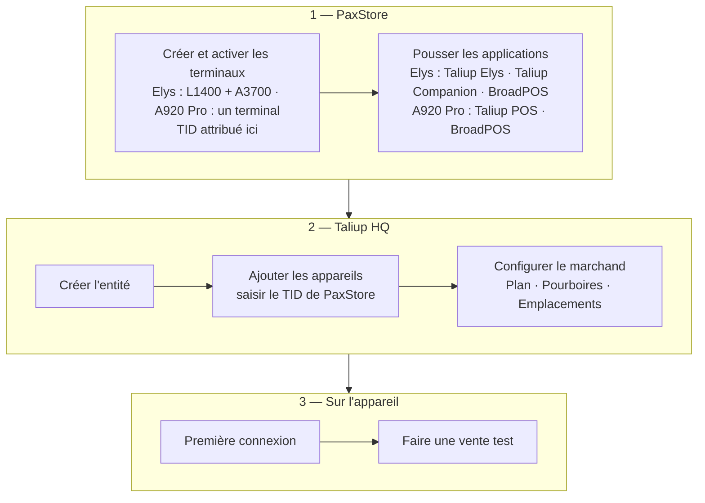

Taliup prend en charge deux configurations PAX. Les étapes dépendent de l'appareil du marchand.

<Frame caption="PAX Elys (terminal caissier L1400 + écran client A3700) à gauche, et le PAX A920 Pro autonome à droite.">
  
</Frame>

## Appareils pris en charge

| Appareil | Format | Applications installées |
|---|---|---|
| **PAX Elys** (L1400 + A3700) | Paire — terminal caissier L1400 et écran client A3700 | Taliup Elys (L1400) · BroadPOS Manager, application BroadPOS de l'acquéreur, Taliup Companion (A3700) |
| **PAX A920 Pro** | Appareil autonome tout-en-un | BroadPOS Manager · application BroadPOS de l'acquéreur · Taliup POS |

## Ordre de configuration

Suivez ces étapes dans l'ordre pour chaque marchand :

<Steps>
  <Step title="Configuration PaxStore">
    Créez et activez le ou les terminaux dans PaxStore. Poussez les bonnes applications pour le type d'appareil. Notez le **TID** de chaque terminal — vous les saisirez dans Taliup HQ.

    [Configuration PaxStore →](/fr-CA/taliup-hq/devices/pax/paxstore)
  </Step>
  <Step title="Ajouter les appareils dans Taliup HQ">
    Enregistrez chaque terminal comme **Device** dans Taliup HQ avec le TID de PaxStore. L'enregistrement doit être terminé avant la première connexion sur l'appareil.

    [Ajouter des appareils PAX dans HQ →](/fr-CA/taliup-hq/devices/pax/add-devices)
  </Step>
  <Step title="Configuration sur l'appareil">
    Première connexion, configuration de la connexion (PAX Elys seulement), jumelage (PAX Elys seulement) et vente test. Couvert dans la documentation Taliup POS.
  </Step>
</Steps>

## Avant de commencer

### PAX Elys (L1400 + A3700)

- Les deux appareils allumés. En mode **USB Preferred** (défaut), un Wi-Fi partagé n'est pas requis pour PAX LinkUp. En mode **TCP Only** ou en repli TCP, les deux appareils doivent être sur le même réseau Wi-Fi (pas un Wi-Fi invité ni un segment séparé).
- Accès à **PaxStore** avec le bon Administrator Center et le compte Reseller.
- Accès à **Taliup HQ** à [taliuphq.com](https://taliuphq.com) avec la permission de créer des Entités et des Devices.
- La **fiche VAR** de l'acquéreur pour l'application de paiement BroadPOS sur l'A3700.
- Un **code démo** de votre ISO si le marchand est sur un plan Subscription (demandez le code à votre ISO ou partenaire).

### PAX A920 Pro

- Appareil allumé et connecté à Internet.
- Accès à **PaxStore** avec le bon Administrator Center et le compte Reseller.
- Accès à **Taliup HQ** à [taliuphq.com](https://taliuphq.com) avec la permission de créer des Entités et des Devices.
- La **fiche VAR** de l'acquéreur pour l'application de paiement BroadPOS sur l'A920 Pro.
- Un **code démo** de votre ISO si le marchand est sur un plan Subscription (demandez le code à votre ISO ou partenaire).
