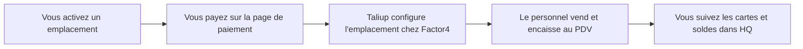

Les Cartes-cadeaux vous permettent de vendre et d'encaisser des cartes-cadeaux à votre point de vente. Les cartes sont émises et suivies par Factor4, notre fournisseur de cartes-cadeaux. Taliup HQ vous donne la liste des cartes, les soldes et l'historique d'activité.

Vous activez les Cartes-cadeaux **un emplacement à la fois**, sous forme de module mensuel. Votre entreprise dispose d'un seul programme de cartes-cadeaux chez Factor4 : le premier emplacement activé le crée, et chaque emplacement activé par la suite s'y joint.

Ouvrez **Cartes-cadeaux** dans la barre latérale marchand.

---

## Prérequis

<Steps>
  <Step title="Cartes-cadeaux disponible dans votre plan">
    Votre admin ISO active **Cartes-cadeaux** dans le plan de l'entité. Si vous ne voyez pas **Cartes-cadeaux** dans la barre latérale, demandez-lui de l'ajouter dans [Plans et fonctionnalités](/fr-CA/taliup-hq/onboarding/plans-features).
  </Step>
  <Step title="Au moins un terminal à l'emplacement">
    Un emplacement doit avoir un terminal enregistré avant d'être activé. Le terminal est enregistré chez Factor4 pendant la configuration pour pouvoir traiter les cartes-cadeaux. Voir [Ajouter des appareils dans HQ](/fr-CA/taliup-hq/devices/pax/add-devices).
  </Step>
  <Step title="Une carte pour les frais mensuels">
    L'activation est un abonnement mensuel récurrent. Vous payez sur une page de paiement sécurisée pendant l'activation.
  </Step>
</Steps>

---

## Fonctionnement

L'activation est facturée par emplacement. Dès qu'un emplacement est actif, tous ses terminaux peuvent vendre et encaisser des cartes-cadeaux.

Les cartes sont partagées dans toute votre entreprise. Une carte vendue à un emplacement actif peut être encaissée, consultée ou remboursée à n'importe quel autre de vos emplacements actifs. Elle ne peut pas être utilisée chez une autre entreprise.

Les soldes sont détenus par Factor4. Taliup HQ en garde une copie locale pour que la liste et les rapports restent rapides, et la rafraîchit chaque fois que la carte est utilisée ou vérifiée.

---

## Activer un emplacement

<Steps>
  <Step title="Ouvrir Cartes-cadeaux">
    Chacun de vos emplacements est listé avec son état actuel.
  </Step>
  <Step title="Cliquer sur Activer">
    Cliquez sur **Activer** pour l'emplacement où vous voulez vendre des cartes-cadeaux. Une fenêtre de paiement sécurisée s'ouvre.
  </Step>
  <Step title="Payer">
    Saisissez les informations de votre carte. Si vous êtes déjà abonné à un autre module, le montant est calculé au prorata du reste de la période de facturation et ajouté à votre abonnement existant.
  </Step>
  <Step title="Attendre la configuration">
    Après le paiement, Taliup configure l'emplacement chez Factor4. L'emplacement passe à **Actif** une fois la configuration terminée.
  </Step>
</Steps>

### États d'un emplacement

| État | Signification |
| --- | --- |
| **Prêt à activer** | L'emplacement a un terminal et peut être activé |
| **Paiement en attente** | Un paiement a été amorcé mais non complété |
| **Configuration en cours** | Le paiement a réussi, la configuration chez Factor4 se termine |
| **Actif** | Les cartes peuvent être vendues et encaissées à cet emplacement |
| **Suspendu** | L'abonnement a pris fin ou un paiement a échoué. Les cartes-cadeaux sont désactivées ici |

La liste des cartes reste masquée tant qu'aucun emplacement n'est actif.

<Note>
  Si la configuration chez Factor4 échoue, le montant est automatiquement annulé et l'emplacement reste inactif. Rien n'est facturé pour une configuration qui n'a pas abouti.
</Note>

---

## La liste des cartes

Dès qu'un emplacement est actif, la page liste toutes les cartes-cadeaux que votre entreprise a émises ou acceptées.

| Colonne | Détails |
| --- | --- |
| **Carte** | Numéro masqué avec les quatre derniers chiffres |
| **Statut** | Active, Inactive ou Désactivée |
| **Solde** | Le solde au moment de la dernière utilisation ou vérification |
| **Emplacement** | Où la carte a été émise |
| **Client** | Le client lié, s'il y en a un |

Cherchez par les quatre derniers chiffres, par le numéro masqué ou par nom de client. Filtrez par statut et par emplacement.

---

## Détails d'une carte

Cliquez sur une carte pour l'ouvrir. La page de détails affiche :

- **Solde et statut**, rafraîchis chez Factor4 lors de la dernière utilisation
- **Activité** — les transactions récentes enregistrées par Taliup, avec un bouton pour afficher les plus anciennes
- **Historique de la carte** — le relevé que Factor4 détient pour cette carte
- **Envois** — pour les cartes transmises par courriel, avec une action **Renvoyer**

L'activité et l'historique sont séparés volontairement. L'activité, c'est ce qui s'est passé sur vos terminaux. L'historique, c'est ce que Factor4 a au dossier pour la carte, y compris l'activité ailleurs.

---

## Où apparaissent les cartes-cadeaux

Les paiements par carte-cadeau apparaissent avec vos autres modes de paiement.

| Où | Ce que vous voyez |
| --- | --- |
| **Transactions** | Les encaissements avec le mode de paiement **Carte-cadeau** et le numéro masqué |
| **Commandes** | Le paiement par carte-cadeau sur la commande qu'il a réglée |
| **Rapports** | Les achats et remboursements de cartes-cadeaux comme lignes distinctes |
| **Tableau de bord** | Les totaux de cartes-cadeaux dans le sommaire des ventes |

Vendre une carte-cadeau et l'encaisser sont deux événements différents. Vendre une carte est une vente normale payée comptant ou par carte. L'encaisser, c'est un mode de paiement sur la commande de quelqu'un d'autre.

---

## Gérer l'abonnement

Les activations de cartes-cadeaux sont facturées dans votre abonnement aux modules. Gérez-les dans **Paramètres → Abonnements**.

| Action | Effet |
| --- | --- |
| **Annuler** | Arrête la facturation future. Les cartes-cadeaux fonctionnent jusqu'à la fin de la période déjà payée |
| **Changer la carte** | Met à jour la carte utilisée pour les frais mensuels |
| **Réessayer le paiement** | Encaisse un paiement échoué après la mise à jour de la carte |

L'annulation est différée. À la fin de la période de facturation, l'emplacement est suspendu chez Factor4 et les cartes-cadeaux cessent d'y fonctionner. Les cartes déjà entre les mains des clients conservent leur solde chez Factor4 et restent encaissables à vos autres emplacements actifs, mais l'emplacement suspendu ne peut plus les vendre ni les encaisser.

Si des frais mensuels sont refusés, vous conservez l'accès pendant le délai de grâce, le temps de corriger la carte. Si le délai expire, l'emplacement est suspendu.

---

## Dépannage

### Cartes-cadeaux n'apparaît pas dans la barre latérale

Demandez à votre admin ISO d'activer **Cartes-cadeaux** dans votre plan.

### Activer est grisé

L'emplacement doit avoir au moins un terminal. Ajoutez un terminal, puis rechargez la page.

### La fenêtre de paiement s'est fermée sans rien faire

Rouvrez **Cartes-cadeaux**. Si l'emplacement affiche **Paiement en attente**, le paiement n'a pas abouti. Cliquez de nouveau sur **Activer** pour repartir à neuf.

### L'emplacement reste en Configuration en cours

La configuration chez Factor4 n'a pas abouti. Rechargez la page. Si rien ne change, contactez le soutien : un admin peut voir l'erreur exacte dans le Centre des comptes Factor4.

### Le personnel ne peut pas vendre ni encaisser

Vérifiez que l'emplacement affiche **Actif** et que le terminal lui appartient bien. Les terminaux ajoutés après l'activation sont enregistrés automatiquement chez Factor4, mais un échec d'enregistrement est signalé à votre admin au moment de la création du terminal.

### Une carte affiche le mauvais solde

Le solde affiché date de la dernière utilisation ou vérification. Faites une vérification de solde au PDV pour le rafraîchir.

### Un client n'a jamais reçu sa carte par courriel

Ouvrez la carte, repérez l'envoi et utilisez **Renvoyer**. Vérifiez d'abord l'adresse du destinataire.

---

## Voir aussi

- [Vendre et encaisser au PDV](/fr-CA/taliup-pos/gift-cards/index)
- [Clients](/fr-CA/taliup-hq/features/clients)
- [Plans et fonctionnalités](/fr-CA/taliup-hq/onboarding/plans-features)
