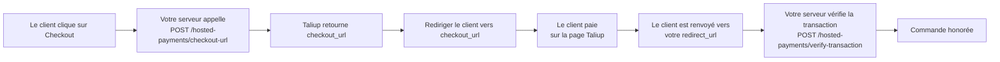

Hosted Payments permet aux marchands d'accepter des paiements sur n'importe quel site, application ou plateforme sans construire une page de paiement. Le backend du marchand génère une URL de paiement sécurisée à usage unique; le client paie sur une page hébergée par Taliup et revient sur le site du marchand.

La fonction s'ouvre via **Hosted Payments** dans la barre latérale marchande.

---

## Prérequis

Trois conditions doivent être remplies avant que les identifiants apparaissent et que la fonction soit utilisable :

<Steps>
  <Step title="Fournisseur de paiement = Elavon">
    L'entité doit être configurée avec **Elavon** comme fournisseur de paiement. C'est défini à la création de l'entité ou dans le [Profil de l'entité](/fr-CA/taliup-hq/manage/profile).
  </Step>
  <Step title="Fonction activée">
    La fonction `Hosted Payment Solution` doit être activée pour l'entité. Activez-la dans [Plans et fonctionnalités](/fr-CA/taliup-hq/onboarding/plans-features).
  </Step>
  <Step title="Passerelle de paiement en ligne configurée">
    Au moins un emplacement doit avoir une **Online Payment Gateway** active (Converge / Elavon). Voir [Emplacements](/fr-CA/taliup-hq/onboarding/locations).
  </Step>
</Steps>

---

## Identifiants API

<Frame caption="L'onglet API Credentials — Merchant Site ID, Secret Key et API Base URL par emplacement.">
  
</Frame>

Les identifiants sont générés **par emplacement**. Lorsqu'une entité a plusieurs emplacements, un sélecteur apparaît en haut de la carte.

| Champ | Description |
|---|---|
| **Merchant Site ID** | Identifiant unique de cet emplacement (`hpm_...`). Envoyé comme en-tête `X-Merchant-Site-Id` dans chaque requête API. Bouton Copy disponible. |
| **Secret Key** | Masquée par défaut. Utilisez **Show** pour la révéler ou **Copy** pour copier sans la révéler. |
| **Rotate Secret Key** | Génère immédiatement une nouvelle clé. Toute intégration qui utilise l'ancienne clé échouera jusqu'à la mise à jour. |
| **API Base URL** | L'URL de base de toutes les requêtes API. |

**URL de base API :**

| Environnement | URL |
|---|---|
| Production | `https://taliuphq.com/api/v1` |
| Staging | `https://staging.taliuphq.com/api/v1` |

<Warning>
  N'exposez jamais la Secret Key dans le code frontal. Toutes les requêtes API doivent partir de votre serveur.
</Warning>

---

## Intégration WooCommerce

<Frame caption="L'onglet WooCommerce — guide en quatre étapes pour installer et configurer le plugin TaliupPay.">
  
</Frame>

L'onglet WooCommerce guide les boutiques WordPress qui utilisent le plugin TaliupPay.

<Steps>
  <Step title="Installer le plugin">
    Dans l'admin WordPress, allez à **Plugins → Add New**. Cherchez **TaliupPay**, ou téléversez le ZIP fourni par votre gestionnaire de compte. Cliquez sur **Install Now** puis **Activate**.
  </Step>
  <Step title="Configurer les identifiants">
    Allez à **WooCommerce → Settings → Payments**. Cliquez sur **TaliupPay**. Saisissez le **Merchant Site ID** et la **Secret Key** de l'onglet API Credentials. Réglez l'**API Base URL** sur `https://taliuphq.com/api/v1`. Cliquez sur **Save Changes**.
  </Step>
  <Step title="Tester un paiement">
    Passez une commande test. Choisissez **TaliupPay** au paiement. Vous serez redirigé vers la page TaliupPay sécurisée.
  </Step>
  <Step title="Passer en production">
    Une fois les tests terminés, désactivez le mode test dans les paramètres du plugin. Les commandes débiteront de vraies cartes.
  </Step>
</Steps>

---

## Intégration directe

<Frame caption="L'onglet Direct Integration — exemples PHP, Node.js et cURL pour générer une URL de paiement depuis votre backend.">
  
</Frame>

L'onglet Direct Integration s'adresse aux développeurs qui veulent appeler l'API Taliup depuis leur backend. La page fournit des exemples PHP, Node.js et cURL.

### Installer le SDK PHP

```bash
composer require taliup/taliuphq-php
```

Le code source est aussi sur [GitHub](https://github.com/Taliup/taliuphq-php).

### Flux d'intégration



### Champs de requête

| Champ | Obligatoire | Notes |
|---|---|---|
| `amount` | Oui | Nombre, minimum `0.01`. |
| `currency` | Recommandé | `CAD` ou `USD`. |
| `reference` | Recommandé | Votre ID de commande ou de facture — transmis à l'enregistrement de transaction. |
| `redirect_url` | Recommandé | Où envoyer le client après un paiement réussi. Max 2048 caractères. |
| `cancel_url` | Recommandé | Où envoyer le client s'il annule. Max 2048 caractères. |
| `first_name` / `last_name` / `email` | Facultatif | Préremplit le formulaire pour une expérience plus fluide. |
| `webhook_url` | Facultatif | Recevoir un POST signé lorsque le paiement est capturé. Voir [Webhooks](#webhooks). |
| `expires_in_minutes` | Facultatif | 5–60. Les défauts varient selon la configuration. |

### Paramètres de l'URL de retour

Après le paiement, Taliup redirige le client vers votre `redirect_url` (ou `cancel_url`) et ajoute ces paramètres :

| Paramètre | Notes |
|---|---|
| `status` | `approved`, `declined`, `cancelled` ou `error`. |
| `amount` | Le montant traité. |
| `currency` | La devise utilisée. |
| `reference` | Votre référence, si fournie. |
| `transaction_id` | L'ID de transaction Taliup. Présent lorsque disponible. |
| `host_response` | Détails de la réponse de l'hôte. |
| `message` | Message lisible, lorsque disponible. |

<Warning>
  Vérifiez toujours la transaction côté serveur avant d'honorer une commande. Après le retour du client, appelez `POST /hosted-payments/verify-transaction` avec le `transaction_id`. Ne vous fiez pas seulement aux paramètres de l'URL de redirection.
</Warning>

### Vérifier la transaction

```bash
curl -X POST "https://taliuphq.com/api/v1/hosted-payments/verify-transaction" \
  -H "Content-Type: application/json" \
  -H "X-Merchant-Site-Id: hpm_xxxxxxxxx" \
  -H "X-Merchant-Secret-Key: hpsk_xxxxxxxxx" \
  -d '{"transaction_id":"1234567890"}'
```

Réponse de succès :

```json
{
  "success": true,
  "approved": true,
  "transaction_id": "1234567890",
  "result_code": "0",
  "result_message": "APPROVAL"
}
```

Pour la référence API complète, l'authentification et la gestion des erreurs, voir la [documentation du SDK PHP Taliup](/php-sdk/concepts/hosted-payments) (page en anglais).

---

## Page montant libre et don

La page Open Amount & Donation permet aux clients de payer le montant de leur choix — sans code serveur. Idéale pour les dons, adhésions, pourboires ou tout prix flexible.

### Fonctionnement

Le client visite une page d'accueil Taliup (ou clique un bouton intégré), saisit son montant et ses détails, puis paie. En cas de succès :

- Une **commande Taliup** est créée avec le statut `complete`.
- Un **dossier Client** est trouvé par courriel ou créé automatiquement.
- Un **reçu par courriel** facultatif est envoyé au client.

### Reçus fiscaux de don (organismes de bienfaisance)

Si l'industrie de l'entité est **Charity**, la page de don à montant libre peut envoyer un reçu électronique conforme (anglais, français ou espagnol).

Avant que la page de don fonctionne, complétez **Charity Details** sur l'entité :

- **Charity / Registration Number** (obligatoire)
- **Tax ID** (facultatif)
- Une adresse enregistrée complète sur le [profil de l'entité](/fr-CA/taliup-hq/manage/profile)

<Frame caption="Charity Details dans Settings → Business.">
  
</Frame>

Des détails de bienfaisance incomplets bloquent la page d'accueil de don à montant libre et l'appel d'initiation. Le paiement à montant fixe et l'intégration directe fonctionnent toujours.

<Warning>
  N'activez pas Charity et ne partagez pas l'URL `/pay/{merchant_site_id}` tant que **Charity Details** et l'adresse du profil ne sont pas complets. Sinon les donateurs verront une erreur au lieu de la page de paiement.
</Warning>

### Consulter et renvoyer un reçu

Après la capture d'un don d'un organisme de bienfaisance, vous pouvez ouvrir le même reçu fiscal depuis **Transactions**.

<Steps>
  <Step title="Ouvrir Transactions">
    Allez dans **Transactions** et sélectionnez l'onglet **En ligne**.
  </Step>
  <Step title="Sélectionner le don">
    Cliquez sur le don pour ouvrir les détails de la transaction.
  </Step>
  <Step title="Consulter ou envoyer le reçu">
    Cliquez sur **Voir le reçu** pour ouvrir le reçu fiscal envoyé au donateur. Cliquez sur **Envoyer le reçu** pour le renvoyer par courriel. L'adresse par défaut est celle du client lié à la commande. Vous pouvez la modifier avant l'envoi.
  </Step>
</Steps>

Si l'envoi échoue, la fenêtre reste ouverte et affiche une erreur afin que vous puissiez réessayer. Le numéro de reçu sur l'aperçu peut être vide.

<Note>
  **Voir le reçu** et **Envoyer le reçu** apparaissent uniquement pour les dons Charity effectués sur la page à montant libre. Les dons plus anciens n'affichent pas ces actions.
</Note>

### Extraire de code (embed)

<Frame caption="Le sous-onglet Embed Snippet — intégration minimale en deux lignes pour n'importe quelle plateforme.">
  
</Frame>

Le moyen le plus rapide d'ajouter un bouton de paiement. Chargez le SDK et initialisez le bouton :

```html
<!-- 1. Place this container where you want the button -->
<div id="donate-btn"></div>

<!-- 2. Load the TaliupPay SDK -->
<script src="https://taliuphq.com/sdk/v1/taliup-pay.min.js"></script>

<!-- 3. Initialise the button -->
<script>
TaliupPay.Button({
  siteId: 'hpm_YOUR_MERCHANT_SITE_ID',
  mode: 'open',
  label: 'Donate Now',
  color: '#0f172a',
}).render('#donate-btn');
</script>
```

Fonctionne sur toute plateforme qui accepte du HTML personnalisé, y compris Wix, WordPress, Squarespace, Webflow, Shopify, Weebly et GoDaddy.

### Bouton Donate

<Frame caption="Le sous-onglet Donate Button — exemple de page HTML complète pour un bouton à montant libre.">
  
</Frame>

Un exemple de page HTML complète avec le SDK dans `<head>` et un bouton à montant libre dans `<body>`. Le client clique, arrive sur la page Taliup, saisit son montant et paie.

### Bouton à montant fixe

<Frame caption="Le sous-onglet Fixed Amount Button — bouton qui démarre une session pour un montant prédéfini.">
  
</Frame>

Utilisez `mode: 'fixed'` pour facturer un montant précis sans que le client en saisisse un :

```javascript
TaliupPay.Button({
  siteId: 'hpm_YOUR_MERCHANT_SITE_ID',
  mode: 'fixed',
  amount: 25.00,
  currency: 'CAD',
  label: 'Pay $25.00',
  color: '#0f172a',
}).render('#pay-btn');
```

### Rappels onComplete

<Frame caption="Le sous-onglet onComplete Callback — traiter le résultat du paiement dans le navigateur.">
  
</Frame>

Les boutons `open` et `fixed` déclenchent un rappel `onComplete` lorsque le paiement réussit. Le rappel reçoit `{ transaction_id, amount, currency, status }` :

```javascript
TaliupPay.Button({
  siteId: 'hpm_YOUR_MERCHANT_SITE_ID',
  mode: 'open',
  label: 'Donate Now',
  onComplete: function(params) {
    // params = { transaction_id, amount, currency, status }

    // Option 1 — Show an inline thank-you message
    document.getElementById('thanks').style.display = 'block';

    // Option 2 — Redirect to a custom thank-you page
    window.location.href = 'https://yoursite.com/thank-you'
      + '?ref=' + params.transaction_id
      + '&amount=' + params.amount
      + '&currency=' + params.currency;

    // Option 3 — Send to your analytics
    gtag('event', 'purchase', {
      value: params.amount,
      currency: params.currency,
      transaction_id: params.transaction_id,
    });
  },
}).render('#donate-btn');
```

### URL de page d'accueil directe

Aucun embed requis. Partagez cette URL dans un courriel, une publication ou un code QR — les clients arrivent sur votre page Taliup et saisissent leur montant :

```
https://taliuphq.com/pay/{merchant_site_id}
```

---

## Webhooks

Les webhooks livrent une notification signée serveur à serveur lorsqu'un paiement est capturé. Ils s'appliquent au flux **Direct Integration** — passez `webhook_url` dans votre requête `createCheckoutUrl`.

### Charge utile

```json
{
  "event": "payment.captured",
  "merchant_site_id": "hpm_...",
  "transaction_id": "...",
  "amount": 49.99,
  "currency": "USD",
  "status": "captured",
  "card_type": "VISA",
  "card_number_masked": "411111XXXXXX1111",
  "reference": "ORDER-123",
  "timestamp": "2026-06-16T18:00:00Z"
}
```

### Vérifier la signature

Chaque webhook inclut un en-tête `X-Taliup-Signature`. Vérifiez-le toujours avant de traiter la charge utile :

```php
$payload   = file_get_contents('php://input');
$signature = $_SERVER['HTTP_X_TALIUP_SIGNATURE'] ?? '';
$secret    = 'your_merchant_secret_key';
$expected  = 'sha256=' . hash_hmac('sha256', $payload, $secret);

if (!hash_equals($expected, $signature)) {
    http_response_code(401);
    exit;
}
```

La signature est un HMAC-SHA256 du corps brut, signé avec votre **Secret Key**.

<Warning>
  Rejetez toute requête webhook dont la signature ne correspond pas. N'utilisez pas la charge utile pour honorer une commande tant que la signature n'est pas vérifiée.
</Warning>
