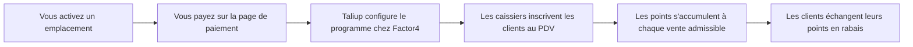

La fidélité permet à vos clients de gagner des points sur leurs achats et de les échanger en rabais à la caisse. Les points sont détenus par Factor4, le même fournisseur que pour les cartes-cadeaux. Taliup HQ vous donne les règles du programme, la liste des membres et l'historique d'activité.

Vous activez la fidélité **un emplacement à la fois**, sous forme de module mensuel. Votre entreprise dispose d'un seul programme de fidélité : le premier emplacement activé le crée, et chaque emplacement activé par la suite s'y joint. Les points gagnés à un emplacement peuvent être échangés à n'importe quel autre de vos emplacements actifs.

Ouvrez **Fidélité** dans la barre latérale marchand.

---

## Prérequis

<Steps>
  <Step title="Fidélité offerte dans votre plan">
    Votre admin ISO active **Fidélité** dans le plan de l'entité. Si vous ne voyez pas **Fidélité** dans la barre latérale, demandez-lui de l'ajouter dans [Plans et fonctionnalités](/fr-CA/taliup-hq/onboarding/plans-features).
  </Step>
  <Step title="Au moins un terminal à l'emplacement">
    Un emplacement a besoin d'un terminal enregistré avant de pouvoir être activé. Le terminal est enregistré chez Factor4 pendant la configuration pour pouvoir traiter les transactions de fidélité. Voir [Ajouter des appareils dans HQ](/fr-CA/taliup-hq/devices/pax/add-devices).
  </Step>
  <Step title="Une carte pour les frais mensuels">
    L'activation est un abonnement mensuel récurrent, facturé séparément des cartes-cadeaux. Vous payez sur une page de paiement sécurisée pendant l'activation.
  </Step>
</Steps>

Les cartes-cadeaux ne sont pas requises pour la fidélité, et la fidélité n'est pas requise pour les cartes-cadeaux. Un emplacement peut avoir l'un, l'autre ou les deux.

---

## Fonctionnement

Un membre est l'un de vos **clients**. Les caissiers le trouvent par numéro de téléphone, courriel ou nom : aucune carte physique n'est nécessaire. En arrière-plan, chaque membre détient un compte Factor4 tiré d'un lot de numéros que Taliup gère pour vous. Vous pouvez aussi lier une carte de fidélité physique si vous en distribuez.

Les points sont calculés par Taliup selon vos règles. Factor4 détient le solde, et Taliup en conserve une copie locale pour que la liste des membres reste rapide, en la rafraîchissant chaque fois que des points sont gagnés, échangés ou consultés.

---

## Activer un emplacement

<Steps>
  <Step title="Ouvrez Fidélité">
    Chacun de vos emplacements est listé avec son état actuel.
  </Step>
  <Step title="Cliquez sur Activer">
    Cliquez sur **Activer** pour l'emplacement où vous voulez offrir la fidélité. Une fenêtre de paiement sécurisée s'ouvre.
  </Step>
  <Step title="Payez">
    Saisissez les informations de votre carte. Si vous avez déjà un autre module, les frais sont calculés au prorata du reste de la période de facturation en cours et ajoutés à votre abonnement existant.
  </Step>
  <Step title="Attendez la configuration">
    Après le paiement, Taliup configure l'emplacement chez Factor4. L'emplacement passe à **Actif** quand la configuration se termine.
  </Step>
</Steps>

### États d'un emplacement

| État | Signification |
| --- | --- |
| **Non activé** | L'emplacement a un terminal et peut être activé |
| **Paiement en attente** | Un paiement a été commencé mais pas complété. Utilisez **Reprendre le paiement** pour le terminer |
| **Configuration en cours** | Le paiement a réussi, la configuration chez Factor4 se termine |
| **Actif** | Les clients peuvent gagner et échanger des points à cet emplacement |
| **Suspendu** | L'abonnement a pris fin ou un paiement a échoué. La fidélité est désactivée à cet emplacement |

Les sections règles, membres et activité apparaissent dès que le programme existe.

<Note>
  Si la configuration chez Factor4 échoue, les frais sont annulés automatiquement et l'emplacement reste inactif. Rien n'est facturé pour une configuration qui n'a pas abouti.
</Note>

---

## Règles du programme

La première activation crée votre programme avec des valeurs par défaut raisonnables. Modifiez-les à tout moment sous **Règles du programme**. Les nouvelles règles s'appliquent aux ventes faites après l'enregistrement.

### Gain de points

| Paramètre | Signification | Par défaut |
| --- | --- | --- |
| **Points par 1,00 $ dépensé** | Combien de points chaque unité monétaire rapporte. `1` = un point par dollar; `0,5` = un point par deux dollars | 1 |
| **Achat minimum pour gagner des points** | Les ventes sous ce montant ne rapportent rien. Laissez vide pour aucun minimum | aucun |
| **Arrondi** | Comment un résultat fractionnaire est arrondi : vers le bas, au plus près ou vers le haut | Vers le bas |

Les points sont calculés sur le **sous-total de la commande après rabais et avant taxes**. Les pourboires, les frais et les taxes ne rapportent jamais de points.

### Échange de points

| Paramètre | Signification | Par défaut |
| --- | --- | --- |
| **Points par récompense** | La taille d'une tranche de récompense | 100 |
| **Valeur de la récompense** | Ce qu'une tranche vaut en rabais | 5,00 |
| **Points minimum pour échanger** | Les membres sous ce seuil ne peuvent pas encore échanger. Laissez vide pour aucun minimum | aucun |

Les récompenses s'échangent par **tranches entières**. Avec les valeurs par défaut, un membre ayant 250 points peut échanger 100 ou 200 points pour un rabais de 5,00 $ ou 10,00 $, et conserve les 50 points restants. Le PDV ne laisse jamais une récompense dépasser le total de la commande.

La récompense s'applique comme **rabais avant taxes** sur la commande : les taxes sont calculées sur ce que le client paie réellement. Ce n'est pas un mode de paiement.

La ligne d'aperçu sous le formulaire montre ce qu'un achat de 100,00 $ rapporte selon vos règles actuelles.

---

## Numéros de carte

Chaque membre a besoin d'un numéro de compte Factor4. Taliup demande un lot de numéros à Factor4 à la création du programme et le renouvelle automatiquement quand il baisse, de sorte que l'inscription sans carte ne demande normalement rien de votre part.

Si vous distribuez des cartes de fidélité physiques, ajoutez leurs numéros sous **Numéros de carte**, un par ligne, sous la forme `numéro` ou `numéro:NIP`. Les numéros déjà dans le lot ou déjà attribués à un membre sont ignorés.

Un caissier peut aussi lier une carte physique précise lors de l'inscription en saisissant son numéro.

---

## Membres

Dès que le programme existe, la page liste tous les membres inscrits.

| Colonne | Notes |
| --- | --- |
| **Membre** | Le nom du client |
| **Coordonnées** | Téléphone et courriel de la fiche client |
| **Compte** | Le numéro de compte Factor4 masqué |
| **Points** | Le solde à la dernière fois où il a été gagné, échangé, ajusté ou consulté |
| **Cumul gagné** | Tous les points jamais attribués au membre |
| **Statut** | Actif, Suspendu ou Fermé |

Un badge **Conflit de profil** signifie que Factor4 a refusé d'associer le téléphone ou le courriel du client au compte, le plus souvent parce que le même téléphone figure déjà sur un autre compte Factor4. Les points sont quand même attribués normalement. Corrigez le numéro de téléphone sur la fiche client s'il est erroné.

---

## Activité récente

Le tableau d'activité liste les dernières inscriptions, gains, échanges et annulations dans tous vos emplacements, avec le membre, l'emplacement, les points concernés et le montant d'achat ou de récompense.

Les points sont annulés automatiquement quand un caissier annule la commande dont ils proviennent. Un échange peut être annulé de la même façon, ce qui rend les points au membre.

Des points gagnés puis dépensés ne peuvent pas être annulés, car un solde ne peut jamais être négatif. Quand une commande est remboursée après qu'une partie de ses points a été dépensée, Taliup reprend ce qui reste du solde, jusqu'aux points que cette commande a rapportés, et consigne le manque sur le gain. Le tableau d'activité affiche ces lignes comme **Ajustement**.

### Ajuster un membre manuellement

Cliquez sur **Ajuster** sur un membre pour ajouter ou retirer des points avec un motif, par exemple un crédit de bonne volonté ou une correction après un remboursement qui n'a pas tout repris. Retirer plus de points que le membre n'en a est refusé. Chaque ajustement est consigné avec son auteur.

---

## Rapports

**Rapports** offre un type **Fidélité** dès que la fidélité est activée. Générez-le pour une période, au besoin pour un emplacement, un terminal ou un employé, comme tout autre rapport. Il est construit à partir de ce que Factor4 a approuvé, et non de ce que la caisse a demandé.

| Section | Contenu |
| --- | --- |
| **Sommaire** | Points gagnés, points échangés, valeur des récompenses accordées en rabais (nette des échanges annulés), ventes admissibles et variation nette des soldes des membres |
| **Adhésion** | Membres actifs, nouveaux membres de la période, points en circulation pour tous les membres et le passif en récompenses que ces points représentent selon vos règles actuelles |
| **Par emplacement, employé, jour** | Les mêmes chiffres de gain et d'échange, ventilés |
| **Principaux membres** | Les membres les plus actifs de la période |
| **Activité** | Chaque transaction de fidélité de la période, y compris annulations, ajustements et refus |

Le passif en récompenses est ce que vos points en circulation coûteraient si chaque membre échangeait aujourd'hui, compté en tranches entières. Les points en circulation et les nombres de membres sont ceux d'aujourd'hui, pas ceux de la fin de la période.

---

## Abonnement

La fidélité apparaît sous **Paramètres > Abonnements** comme un élément par emplacement activé.

| Action | Effet |
| --- | --- |
| **Annuler** | Arrête la facturation future. La fidélité continue de fonctionner jusqu'à la fin de la période déjà payée |
| **Changer la carte** | Met à jour la carte utilisée pour les frais mensuels |
| **Réessayer le paiement** | Encaisse un paiement échoué après la mise à jour de la carte |

L'annulation est différée. À la fin de la période de facturation, l'emplacement est détaché de votre programme et ne peut plus faire gagner ni échanger de points. Les membres conservent leurs points et peuvent encore les utiliser à vos autres emplacements actifs. S'il ne reste aucun emplacement, le programme est suspendu jusqu'à ce que vous en activiez un de nouveau.

Si des frais mensuels sont refusés, vous conservez l'accès pendant le délai de grâce, le temps de corriger la carte. Si le délai expire, l'emplacement est suspendu.

---

## Dépannage

### Fidélité n'est pas dans la barre latérale

Demandez à votre admin ISO d'activer **Fidélité** dans votre plan.

### Activer est grisé

L'emplacement a besoin d'au moins un terminal. Ajoutez un terminal à cet emplacement, puis rechargez la page.

### La fenêtre de paiement s'est fermée et rien ne s'est passé

Rouvrez **Fidélité**. Si l'emplacement affiche **Paiement en attente**, le paiement n'a pas été complété. Cliquez sur **Reprendre le paiement** pour le terminer.

### L'emplacement reste en Configuration en cours

La configuration chez Factor4 n'a pas abouti. Rechargez la page. Si la section des règles affiche une erreur de configuration, contactez le soutien avec le message affiché.

### Un caissier ne trouve pas un client

La recherche compare les chiffres du téléphone, le courriel ou le nom de vos fiches clients. Ajoutez d'abord le client, puis inscrivez-le.

### L'inscription échoue faute de numéros de carte

Le lot est vide et le renouvellement automatique n'a pas eu lieu. Ajoutez des numéros sous **Numéros de carte**, ou contactez le soutien.

### Un membre affiche un mauvais solde

Le solde affiché date du dernier mouvement de points. Demandez à un caissier de consulter le solde au PDV pour le rafraîchir.

---

## Voir aussi

- [La fidélité au PDV](/fr-CA/taliup-pos/loyalty/index)
- [Cartes-cadeaux](/fr-CA/taliup-hq/features/gift-cards)
- [Clients](/fr-CA/taliup-hq/features/clients)
