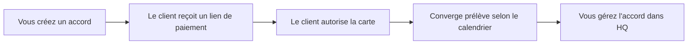

Les paiements récurrents permettent de facturer un client selon un calendrier. Vous créez un accord dans Taliup HQ, envoyez un lien de paiement hébergé, et le client autorise sa carte. Ensuite, Elavon Converge prélève la carte selon la fréquence choisie.

Ouvrez **Recurring Payments** dans la barre latérale marchande.

<Frame caption="La liste Recurring Payments avec les onglets de statut, la recherche client et les lignes d'accord.">
  
</Frame>

---

## Prérequis

<Steps>
  <Step title="Fonction Recurring Payments activée">
    La fonction **Recurring Payments** doit être activée sur le plan de l'entité. L'activer active aussi **Hosted Payment Solution** et **Clients**. Demandez à votre admin ISO de l'activer dans [Plans et fonctionnalités](/fr-CA/taliup-hq/onboarding/plans-features) si vous ne voyez pas **Recurring Payments** dans la barre latérale.
  </Step>
  <Step title="Elavon Converge sur un emplacement">
    Au moins un emplacement doit avoir une passerelle en ligne **Elavon Converge** active. Les emplacements sur d'autres processeurs restent disponibles pour le reste. Voir [Emplacements](/fr-CA/taliup-hq/onboarding/locations).
  </Step>
  <Step title="Client avec un courriel">
    Chaque accord exige un [client](/fr-CA/taliup-hq/features/clients) avec un courriel valide pour envoyer l'invitation de paiement.
  </Step>
</Steps>

Si Converge est manquant, la liste affiche **Elavon Converge required** et vous ne pouvez pas créer d'accords.

---

## Fonctionnement

- Sans essai gratuit, le paiement encaisse le premier cycle aujourd'hui et démarre le calendrier.
- Avec un essai gratuit, le paiement enregistre seulement la carte. Les prélèvements commencent à la fin de l'essai.
- Les cycles suivants sont encaissés par Converge. Taliup HQ synchronise le statut, la prochaine date et l'historique.

---

## Liste des accords

S'il n'y a encore aucun accord, la page affiche **No recurring agreements yet** et **Create your first agreement**.

Utilisez **+ New agreement** une fois Converge disponible. Utilisez **Settings** pour les valeurs par défaut des nouveaux accords.

Onglets :

| Onglet | Contenu |
|---|---|
| **All** | Accords actifs et en attente |
| **Needs attention** | En souffrance, période de grâce, en pause, échec de configuration, lien expiré, ou carte bientôt expirée |
| **Active** | Accords en cours de facturation |
| **Pending** | En attente que le client termine le paiement |
| **Closed** | Terminés ou annulés |

Recherchez par nom de client, puis **Apply**. Cliquez une ligne pour ouvrir l'accord. **Copy link** copie le lien de paiement (en attente) ou le lien de gestion client (après inscription).

S'il y a quelque chose à traiter, la liste s'ouvre sur **Needs attention**.

---

## Créer un accord

<Frame caption="Le formulaire New recurring agreement avec client, articles, calendrier et total par cycle.">
  
</Frame>

<Steps>
  <Step title="Ouvrir New agreement">
    Depuis **Recurring Payments**, cliquez sur **+ New agreement**.
  </Step>
  <Step title="Choisir le client et l'emplacement">
    Cherchez un client ou utilisez le bouton personne-plus pour en ajouter un. Si ce courriel appartient à un client supprimé, Taliup demande **Restore previous client?** Voir [Restaurer un client supprimé](/fr-CA/taliup-hq/features/clients#restaurer-un-client-supprimé).
  </Step>
  <Step title="Ajouter les articles">
    Cherchez des produits et services, ou **Add custom item**. Réglez la quantité et les options. Les taxes suivent l'emplacement choisi.
  </Step>
  <Step title="Définir le calendrier">
    Choisissez la fréquence. Offrez au besoin un essai gratuit et une date de fin.
  </Step>
  <Step title="Create agreement">
    Vérifiez le **Per-cycle total**, puis cliquez sur **Create agreement**. Taliup envoie le lien de paiement au client.
  </Step>
</Steps>

### Client

| Réglage | Description |
|---|---|
| **Client** | Obligatoire. Doit avoir un courriel. |
| **Location** | L'emplacement dont la passerelle Converge encaisse les prélèvements. |
| **Allow this customer to cancel** | Lorsque c'est activé, le client peut annuler depuis sa page de gestion. Vous pouvez toujours annuler depuis HQ. La valeur par défaut vient des Settings. |

### Articles du forfait

Cherchez dans le catalogue ou ajoutez un article personnalisé. Les articles avec options ouvrent le sélecteur d'options. Les articles personnalisés peuvent avoir leurs propres taxes.

Vous ne pouvez pas changer les articles du catalogue après la création. Changez le montant plus tard dans **Update schedule**.

### Calendrier

| Réglage | Description |
|---|---|
| **Frequency** | **Daily**, **Weekly**, **Biweekly**, **Monthly** ou **Annually**. La valeur par défaut des Settings préremplit ce champ. |
| **Offer a free trial** | Le client autorise une carte maintenant. Les prélèvements commencent après l'essai. |
| **Trial length** | 1 à 90 jours. Le formulaire affiche la date du premier prélèvement. |
| **End date** | Facultatif. Laissez vide pour facturer jusqu'à annulation. |

L'expiration du lien de paiement (7 jours par défaut) s'affiche sur ce formulaire. Modifiez-la dans Settings.

Sans essai gratuit, le paiement encaisse aujourd'hui. La date du premier prélèvement n'est un champ distinct que si l'essai est activé.

### Total par cycle

La barre latérale affiche le sous-total, les taxes et le total de chaque cycle. C'est le montant que Converge prélève après l'inscription (et au paiement s'il n'y a pas d'essai).

---

## Après la création

L'accord commence en **Pending**.

<Frame caption="La page Agreement avec statut, carte, lien de gestion client, calendrier, articles et prélèvements.">
  
</Frame>

| Action | Quand elle apparaît |
|---|---|
| **Resend email** | En attente, et le lien de paiement est encore valide |
| **Copy link** | Lien de paiement en attente, ou lien de gestion client après inscription |
| **Cancel agreement** | Arrête un paiement en attente, ou arrête les prélèvements futurs sur un accord inscrit |

Le lien de paiement expire après la fenêtre d'invitation et ne peut servir qu'une fois. Un lien expiré ne peut pas être renvoyé. Créez un nouvel accord si le client doit encore s'inscrire.

Après le paiement :

- Un prélèvement apparaît sous **Charges** (ou la carte est enregistrée s'il s'agit d'un essai gratuit).
- Le statut passe à **Active**.
- Le **Customer manage link** apparaît. Il n'expire pas. Les clients l'utilisent pour voir l'historique et mettre à jour leur carte.

---

## Statuts

| Statut | Signification |
|---|---|
| **Pending** | En attente du paiement |
| **Active** | Le calendrier est en cours |
| **Past due** | Un prélèvement prévu a échoué. Le calendrier reste en place |
| **Grace period** | Converge est dans sa fenêtre de nouvelle tentative |
| **Suspended** | Vous avez mis l'accord en pause. Les prélèvements futurs sont arrêtés |
| **Completed** | La date de fin est atteinte |
| **Cancelled** | Vous ou le client avez annulé. Les prélèvements passés restent capturés |
| **Failed** | L'inscription n'est pas terminée. Le client peut avoir besoin d'un nouvel accord |

---

## Charge now

**Charge now** n'apparaît que sur les accords **Past due** ou **Grace period** qui ont déjà un calendrier Converge.

Il encaisse un paiement manqué aujourd'hui. Il n'attend pas la prochaine date prévue. Il n'est pas disponible sur **Active**.

<Steps>
  <Step title="Ouvrir l'accord">
    Ouvrez un accord **Past due** ou **Grace period**.
  </Step>
  <Step title="Charge now">
    Cliquez sur **Charge now**. Confirmez le montant et les quatre derniers chiffres de la carte.
  </Step>
  <Step title="Ignorer le prochain prélèvement">
    L'interrupteur **Skip the next scheduled charge on {date}** est activé par défaut si cette date est aujourd'hui ou demain. Laissez-le activé si vous ne voulez pas que Converge prélève encore à cette date. Désactivez-le si le cycle régulier doit tout de même s'exécuter.
  </Step>
</Steps>

Si la carte est approuvée, Taliup affiche **The missed payment was collected.** Le statut revient à **Active** lorsque la prochaine date Converge est dans le futur. Il peut rester **Past due** si cette date est encore aujourd'hui ou déjà passée.

Si la carte est refusée, l'accord reste en souffrance. Le client et le marchand reçoivent des courriels de refus. Réessayez après une mise à jour de carte, ou au prochain essai prévu.

Le reçu Charge now indique qu'il s'agit d'un paiement manqué encaissé aujourd'hui. Les reçus de cycle régulier nomment plutôt la période de facturation.

---

## Quand un prélèvement est refusé

Une bannière rouge sur l'accord indique **The latest charge was declined.** Elle peut inclure la réponse du processeur.

Taliup vous envoie un courriel, ainsi qu'au client. Le client peut ouvrir le lien de gestion et cliquer sur **Update payment method**. Mettre à jour la carte n'encaisse pas le paiement manqué.

<Frame caption="Un accord Past due après la mise à jour de carte. Charge now est disponible.">
  
</Frame>

Après la mise à jour de carte, une bannière bleue affiche **The customer updated the card on file** et la date. Si l'accord est encore en souffrance, elle rappelle d'utiliser **Charge now**.

La bannière reste jusqu'à ce que :

- le statut soit de nouveau **Active**, ou
- un prélèvement réussi soit encaissé à la date de mise à jour ou après (Charge now ou le prochain cycle)

---

## Pause, reprise et annulation

| Action | Effet |
|---|---|
| **Pause** | Disponible sur Active, Past due et Grace period. Converge arrête les prélèvements futurs jusqu'à la reprise. |
| **Resume** | Disponible sur Suspended. Les prélèvements planifiés reprennent. |
| **Cancel agreement** | Arrête les prélèvements futurs. Les prélèvements passés restent capturés. Une annulation en attente désactive seulement le lien de paiement. |

Vous ne pouvez pas changer la fréquence ni la prochaine date de paiement pendant une pause. Reprenez d'abord.

Les clients peuvent annuler depuis la page de gestion seulement si **Allow this customer to cancel** est activé pour cet accord.

---

## Update schedule

Sur un accord inscrit, **Update schedule** peut modifier :

- **Amount**
- **Frequency** (pas pendant une pause)
- **Next payment** (pas pendant une pause)
- **End date**

Les articles du catalogue restent les mêmes. Cliquez sur **Save schedule**.

---

## Settings

Depuis la liste Recurring Payments, cliquez sur **Settings**.

<Frame caption="Recurring Payment Settings pour l'accès client, les invitations, les valeurs par défaut et les alertes.">
  
</Frame>

| Réglage | Description |
|---|---|
| **Allow customers to cancel** | Valeur par défaut des nouveaux accords. Vous pouvez encore la remplacer à la création. Désactivé par défaut. |
| **Checkout link expiry (days)** | Durée de validité du lien du premier paiement (1–90, 7 par défaut). Un lien expiré ne peut pas être renvoyé. |
| **Default billing frequency** | Préremplit **New agreement**. |
| **Card expiry warning (days)** | Délai avant que **Needs attention** signale une carte bientôt expirée (60 par défaut). |

Cliquez sur **Save Recurring Payment Settings**.

---

## Ce que voient les clients

Les clients ne se connectent pas à Taliup HQ.

- **Checkout link** — page à usage unique pour payer aujourd'hui ou autoriser une carte pour un essai gratuit. Ils doivent cocher **I authorize {merchant} to charge my card…**
- **Customer manage link** — n'expire pas. Les clients voient le calendrier, l'historique et **Update payment method**. **Cancel payment** n'apparaît que si vous l'avez autorisé.

Partagez l'un ou l'autre lien depuis la page de l'accord. Le lien de gestion figure aussi dans les courriels client après l'inscription.

---

## Courriels

| Courriel | Moment d'envoi |
|---|---|
| Invitation de paiement | À la création, et quand vous cliquez sur **Resend email** |
| Reçu | Après un cycle réussi ou un Charge now |
| Paiement refusé | Après l'échec du dernier prélèvement — envoyé à vous et au client |
| Calendrier mis à jour | Quand vous changez le montant, la fréquence ou les dates |

Demandez au client de vérifier les indésirables si l'invitation manque. Confirmez le courriel du client sur l'accord avant de renvoyer.

---

## Dépannage

### Recurring Payments n'est pas dans la barre latérale

Demandez à votre ISO d'activer **Recurring Payments** sur le plan de l'entité. Cela exige **Hosted Payment Solution** et **Clients**.

### Vous ne pouvez pas créer d'accord

Ajoutez une passerelle Elavon Converge active à au moins un emplacement.

### Le client n'a pas reçu le courriel de paiement

1. Confirmez le courriel du client sur l'accord.
2. Demandez-lui de vérifier les indésirables.
3. Utilisez **Resend email** si le lien est encore valide, ou **Copy link** et envoyez-le vous-même.
4. Si le lien a expiré, créez un nouvel accord.

### Le lien a expiré ou n'est plus disponible

Le lien du premier paiement est à usage unique et expire après la fenêtre d'invitation. Créez un nouvel accord pour un nouveau lien.

### Le dernier prélèvement a été refusé

Envoyez au client le lien de gestion pour qu'il mette à jour sa carte. Utilisez ensuite **Charge now** si vous devez encaisser le paiement manqué aujourd'hui. La prochaine tentative prévue a toujours lieu, sauf si vous l'ignorez depuis Charge now.

### Charge now est absent

L'accord doit être **Past due** ou **Grace period**, et le paiement doit déjà avoir inscrit le calendrier Converge. Les accords Pending et Active n'affichent pas Charge now.

### La carte a été mise à jour mais l'accord est encore en souffrance

Mettre à jour la carte n'encaisse pas le paiement manqué. Utilisez **Charge now**, ou attendez le prochain prélèvement prévu.

### Le client veut arrêter la facturation

Utilisez **Cancel agreement**, ou demandez-lui d'annuler depuis la page de gestion si vous l'avez autorisé. Utilisez Pause pour arrêter les prélèvements temporairement.

---

## Connexe

- [Clients](/fr-CA/taliup-hq/features/clients)
- [Paiements hébergés](/fr-CA/taliup-hq/features/hosted-payments)
- [Emplacements](/fr-CA/taliup-hq/onboarding/locations)
- [Plans et fonctionnalités](/fr-CA/taliup-hq/onboarding/plans-features)
