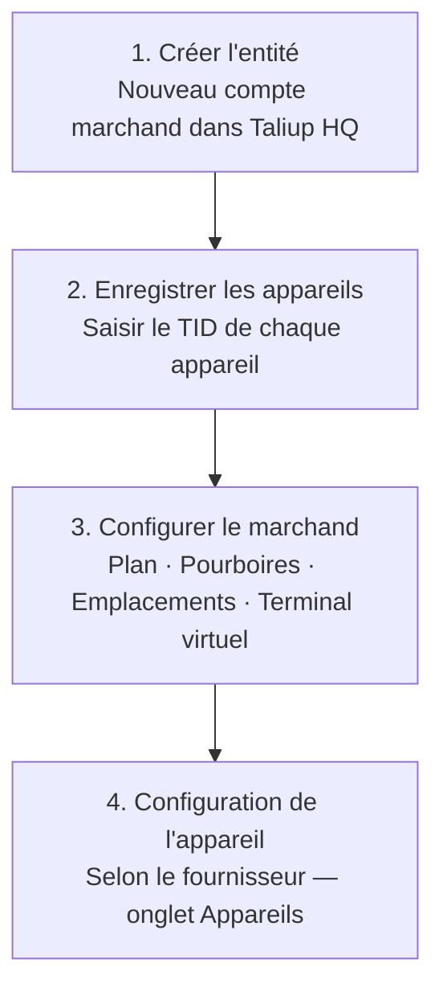

[Taliup HQ](https://taliuphq.com) est le tableau de bord central pour les ISO et les intégrateurs. Utilisez-le pour créer des comptes marchands (entités), enregistrer les appareils de paiement, configurer les paramètres de paiement et gérer l'environnement Taliup du marchand.

<Frame caption="Tableau de bord Taliup HQ — le hub central pour la gestion des marchands et des appareils.">
  
</Frame>

## Intégrer un marchand

Suivez ces étapes dans l'ordre pour un nouveau marchand :

<Steps>
  <Step title="Créer un marchand (entité)">
    Créez le compte marchand dans Taliup HQ. Le premier utilisateur Employé est créé automatiquement.

    [Créer un marchand →](/fr-CA/taliup-hq/create-entity)
  </Step>
  <Step title="Enregistrer les appareils">
    Avant que le personnel puisse se connecter, chaque appareil doit être enregistré dans Taliup HQ avec le TID de votre fournisseur (par exemple, PaxStore pour les appareils PAX).

    [Configuration des appareils PAX →](/fr-CA/taliup-hq/devices/pax/index)
  </Step>
  <Step title="Configurer les paramètres du marchand">
    Configurez au besoin Plans et fonctionnalités, Pourboires, Emplacements, Terminal virtuel, Double tarification et Frais supplémentaires. Pour les marchands du Québec, activez [MEV-WEB](/fr-CA/taliup-hq/onboarding/web-srm) avant que le personnel inscrive un appareil.

    [Aperçu de la configuration →](/fr-CA/taliup-hq/onboarding/plans-features)
  </Step>
</Steps>

## Ce que vous pouvez configurer

<CardGroup cols={2}>
  <Card title="Plans et fonctionnalités" icon="star" href="/fr-CA/taliup-hq/onboarding/plans-features">
    Définir le palier de facturation du marchand et contrôler les fonctions disponibles.
  </Card>
  <Card title="Pourboires" icon="hand-holding-dollar" href="/fr-CA/taliup-hq/onboarding/tips">
    Activer les invites de pourboire à l'écran client, en pourcentage ou en montant fixe.
  </Card>
  <Card title="Emplacements" icon="location-dot" href="/fr-CA/taliup-hq/onboarding/locations">
    Gérer les sites physiques, les MID et les identifiants de passerelle en ligne.
  </Card>
  <Card title="Terminal virtuel" icon="monitor" href="/fr-CA/taliup-hq/onboarding/virtual-terminal">
    Traiter les paiements carte absente depuis le tableau de bord Taliup HQ.
  </Card>
  <Card title="Double tarification" icon="tags" href="/fr-CA/taliup-hq/onboarding/dual-pricing">
    Afficher un prix comptant et un prix carte à la caisse, la différence couvrant les frais de traitement.
  </Card>
  <Card title="Frais supplémentaires" icon="percent" href="/fr-CA/taliup-hq/onboarding/surcharge">
    Ajouter des frais fixes ou en pourcentage au total pour les paiements par carte.
  </Card>
  <Card title="MEV-WEB" icon="file-certificate" href="/fr-CA/taliup-hq/onboarding/web-srm">
    Activer le WEB-SRM de Revenu Québec et enregistrer les identifiants dont Taliup POS a besoin pour s'inscrire comme SRS.
  </Card>
</CardGroup>
