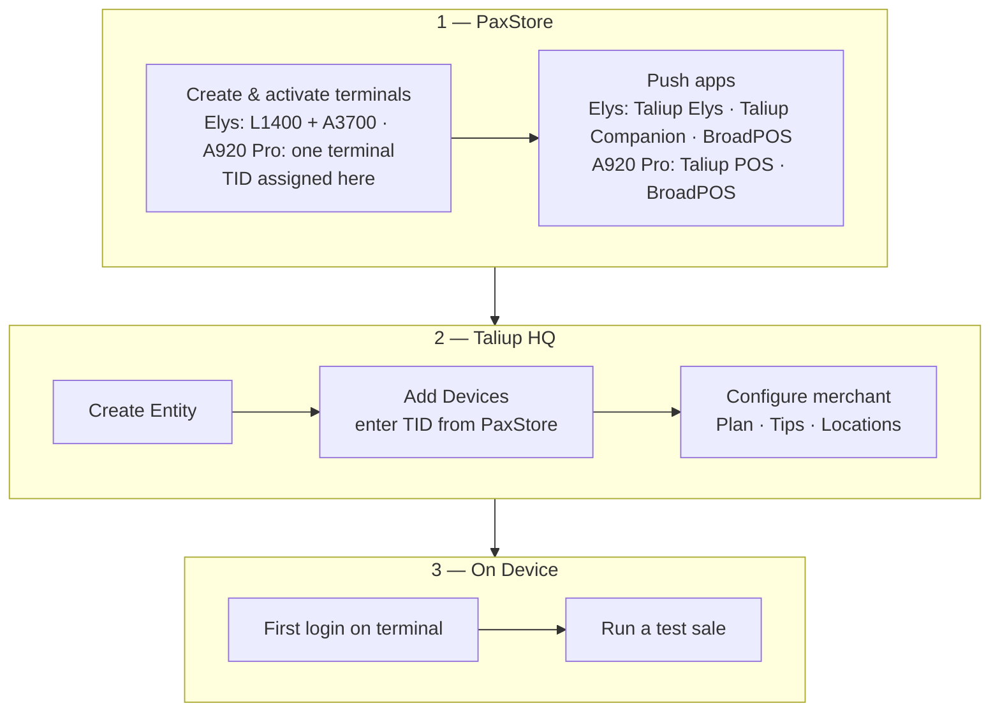

Taliup supports two PAX terminal configurations. The correct setup steps depend on which device the merchant has.

<Frame caption="PAX Elys (L1400 cashier terminal + A3700 customer display) on the left, and the PAX A920 Pro standalone terminal on the right.">
  
</Frame>

## Supported devices

| Device | Form factor | Apps installed |
|---|---|---|
| **PAX Elys** (L1400 + A3700) | Two-device pair — L1400 cashier terminal and A3700 customer display | Taliup Elys (L1400) · BroadPOS Manager, acquirer BroadPOS app, Taliup Companion (A3700) |
| **PAX A920 Pro** | Single standalone terminal — all-in-one | BroadPOS Manager · acquirer BroadPOS app · Taliup POS |

## Setup order

Complete these steps in order for each merchant:

<Steps>
  <Step title="PaxStore setup">
    Create and activate the terminal(s) in PaxStore. Push the correct apps for the device type. Note the **TID** for each terminal — you will enter these in Taliup HQ.

    [PaxStore setup →](/taliup-hq/devices/pax/paxstore)
  </Step>
  <Step title="Add devices in Taliup HQ">
    Register each terminal as a **Device** in Taliup HQ using the TID from PaxStore. Device registration must be complete before the first login on the terminal.

    [Add PAX devices in HQ →](/taliup-hq/devices/pax/add-devices)
  </Step>
  <Step title="On-device setup">
    First login, connection configuration (PAX Elys only), pairing (PAX Elys only), and test sale. This is covered in the Taliup POS documentation.
  </Step>
</Steps>

## Before you start

### PAX Elys (L1400 + A3700)

- Both devices powered on. For **USB Preferred** mode (default), a shared Wi-Fi network is not required for PAX LinkUp. For **TCP Only** mode or TCP fallback, both devices must be on the same Wi-Fi network (not guest Wi-Fi or a separate network segment).
- Access to **PaxStore** with the correct Administrator Center and Reseller account.
- Access to **Taliup HQ** at [taliuphq.com](https://taliuphq.com) with permission to create Entities and Devices.
- The acquirer **VAR sheet** for the BroadPOS payment app on the A3700.
- A **demo passcode** from your ISO if the merchant is on a Subscription plan (the default ISO demo passcode is often `000000`).

### PAX A920 Pro

- Device powered on and connected to the internet.
- Access to **PaxStore** with the correct Administrator Center and Reseller account.
- Access to **Taliup HQ** at [taliuphq.com](https://taliuphq.com) with permission to create Entities and Devices.
- The acquirer **VAR sheet** for the BroadPOS payment app on the A920 Pro.
- A **demo passcode** from your ISO if the merchant is on a Subscription plan (the default ISO demo passcode is often `000000`).
