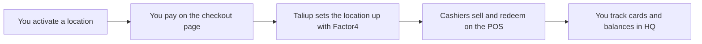

Gift Cards lets you sell and redeem branded gift cards on your point of sale. Cards are issued and tracked by Factor4, our gift card processor. Taliup HQ gives you the card list, balances, and activity history.

You activate Gift Cards **one location at a time** as a monthly add-on. Each activated location gets its own gift card setup with Factor4.

Open **Gift Cards** in the merchant sidebar.

---

## Prerequisites

<Steps>
  <Step title="Gift Cards available on your plan">
    Your ISO admin enables **Gift Cards** on the entity plan. If you do not see **Gift Cards** in the sidebar, ask them to add it in [Plans & Features](/taliup-hq/onboarding/plans-features).
  </Step>
  <Step title="At least one terminal on the location">
    A location needs a registered terminal before it can be activated. The terminal is registered with Factor4 during setup so it can run gift card transactions. See [Add devices in HQ](/taliup-hq/devices/pax/add-devices).
  </Step>
  <Step title="A card for the monthly charge">
    Activation is a recurring monthly subscription. You pay on a secure checkout page during activation.
  </Step>
</Steps>

---

## How it works

Activation is charged per location. Once a location is active, any terminal at that location can sell and redeem gift cards.

Card balances live with Factor4. Taliup HQ keeps a local copy so the card list and reports stay fast, and refreshes it every time the card is used or checked.

---

## Activate a location

<Steps>
  <Step title="Open Gift Cards">
    Each of your locations is listed with its current state.
  </Step>
  <Step title="Click Activate">
    Click **Activate** on the location you want to sell gift cards at. A secure checkout window opens.
  </Step>
  <Step title="Pay">
    Enter your card details. If you already subscribe to another add-on, the charge is prorated for the rest of the current billing period and added to your existing subscription.
  </Step>
  <Step title="Wait for setup">
    After payment, Taliup sets the location up with Factor4. The location moves to **Active** when setup finishes.
  </Step>
</Steps>

### Location states

| State | Meaning |
| --- | --- |
| **Ready To Activate** | The location has a terminal and can be activated |
| **Checkout pending** | A checkout was started but not paid yet |
| **Provisioning** | Payment succeeded, setup with Factor4 is finishing |
| **Active** | Cards can be sold and redeemed at this location |
| **Suspended** | The subscription ended or a payment failed. Gift cards are off at this location |

The card list stays hidden until at least one location is active.

<Note>
  If setup with Factor4 fails, the charge is reversed automatically and the location stays inactive. Nothing is billed for a setup that did not complete.
</Note>

---

## The card list

Once a location is active, the page lists every gift card your business has issued or accepted.

| Column | Notes |
| --- | --- |
| **Card** | Masked number with the last four digits |
| **Status** | Active, Inactive, or Deactivated |
| **Balance** | The balance as of the last time the card was used or checked |
| **Location** | Where the card was issued |
| **Customer** | The linked client, when there is one |

Search by the last four digits, the masked number, or a customer name. Filter by status and by location.

---

## Card details

Click a card to open it. The detail page shows:

- **Balance and status**, refreshed from Factor4 the last time the card was used
- **Activity** — the most recent gift card transactions recorded by Taliup, with Show more for older entries
- **Card history** — the statement Factor4 holds for the card
- **Deliveries** — for cards sent by email, with a **Resend** action

Activity and history are separate on purpose. Activity is what happened on your terminals. History is what Factor4 has on file for the card, including activity from anywhere else the card was used.

---

## Where gift card sales appear

Gift card payments show up alongside your other tenders.

| Where | What you see |
| --- | --- |
| **Transactions** | Redemptions listed with a **Gift Card** payment method and the masked card number |
| **Orders** | The gift card tender on the order it paid for |
| **Reports** | Gift card purchases and refunds as their own lines in the sales report |
| **Dashboard** | Gift card totals in the sales summary |

Selling a gift card and redeeming one are different events. Selling a card is a normal sale paid by cash or card. Redeeming a card is a payment method on someone else's order.

---

## Manage the subscription

Gift card activations are billed as part of your add-on subscription. Manage them in **Settings → Subscriptions**.

| Action | What it does |
| --- | --- |
| **Cancel** | Stops future billing. Gift cards keep working until the end of the period you already paid for |
| **Change card** | Updates the card used for the monthly charge |
| **Retry payment** | Collects a failed charge after you update the card |

Cancellation is deferred. At the end of the billing period, the location is suspended with Factor4 and gift cards stop working there. Cards already in customers' hands keep their balance with Factor4, but your terminals can no longer redeem them.

If a monthly charge is declined, you keep access during the grace period while you fix the card. If the grace period runs out, the location is suspended.

---

## Troubleshooting

### Gift Cards is not in the sidebar

Ask your ISO admin to enable **Gift Cards** on your plan.

### Activate is greyed out

The location needs at least one terminal. Add a terminal to that location, then reload the page.

### The checkout window closed and nothing happened

Reopen **Gift Cards**. If the location shows **Checkout pending**, the payment did not complete. Click **Activate** again to start a fresh checkout.

### The location is stuck on Provisioning

Setup with Factor4 did not finish. Reload the page. If it does not clear, contact support — an admin can see the exact setup error in the Factor4 Accounts Hub.

### A cashier cannot sell or redeem

Check that the location shows **Active** and that the terminal belongs to that location. Terminals added after activation are registered with Factor4 automatically, but a registration failure is reported to your admin at the time the terminal is created.

### A card shows the wrong balance

The balance shown is from the last time the card was used or checked. Run a balance check on the POS to refresh it.

### A customer never received an emailed card

Open the card, find the delivery, and use **Resend**. Confirm the recipient address first.

---

## Related

- [Sell and redeem on the POS](/taliup-pos/gift-cards/index)
- [Clients](/taliup-hq/features/clients)
- [Plans & Features](/taliup-hq/onboarding/plans-features)
