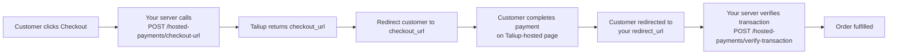

Hosted Payments lets merchants accept payments on any website, app, or platform without building a checkout page. The merchant's backend generates a secure, one-time checkout URL; the customer completes payment on a Taliup-hosted page and is returned to the merchant's site.

The feature is accessed via **Hosted Payments** in the merchant sidebar.

---

## Prerequisites

Three conditions must be met before credentials appear and the feature is usable:

<Steps>
  <Step title="Payment provider = Elavon">
    The entity must be configured with **Elavon** as its payment provider. This is set during entity creation or can be updated in the [Entity Profile](/taliup-hq/manage/profile).
  </Step>
  <Step title="Feature enabled">
    The `Hosted Payment Solution` feature must be enabled for the entity. Enable it in [Plans & Features](/taliup-hq/onboarding/plans-features).
  </Step>
  <Step title="Online Payment Gateway configured">
    At least one location must have an active **Online Payment Gateway** (Converge / Elavon) set up. See [Locations](/taliup-hq/onboarding/locations) for setup instructions.
  </Step>
</Steps>

---

## API Credentials

<Frame caption="The API Credentials tab — Merchant Site ID, Secret Key, and API Base URL per location.">
  
</Frame>

Credentials are generated **per location**. When an entity has multiple locations, a location selector appears at the top of the card.

| Field | Description |
|---|---|
| **Merchant Site ID** | Unique identifier for this location (`hpm_...`). Passed as the `X-Merchant-Site-Id` header in every API request. Copy button available. |
| **Secret Key** | Masked by default. Use the **Show** button to reveal it or **Copy** to copy without revealing. |
| **Rotate Secret Key** | Generates a new secret key immediately. Any existing integration using the old key will fail until updated with the new value. |
| **API Base URL** | The base URL for all API requests. |

**API Base URLs:**

| Environment | URL |
|---|---|
| Production | `https://taliuphq.com/api/v1` |
| Staging | `https://staging.taliuphq.com/api/v1` |

<Warning>
  Never expose the Secret Key in frontend code. All API requests must be made from your server.
</Warning>

---

## WooCommerce Integration

<Frame caption="The WooCommerce tab — four-step guide to install and configure the TaliupPay WooCommerce plugin.">
  
</Frame>

The WooCommerce tab provides a guided setup for WordPress stores using the TaliupPay WooCommerce plugin.

<Steps>
  <Step title="Install the Plugin">
    In your WordPress admin, go to **Plugins → Add New**. Search for **TaliupPay**, or upload the plugin ZIP file provided by your account manager. Click **Install Now** then **Activate**.
  </Step>
  <Step title="Configure Credentials">
    Go to **WooCommerce → Settings → Payments**. Click **TaliupPay** to configure. Enter your **Merchant Site ID** and **Secret Key** from the API Credentials tab. Set the **API Base URL** to `https://taliuphq.com/api/v1`. Click **Save Changes**.
  </Step>
  <Step title="Test a Payment">
    Place a test order in your store. Select **TaliupPay** as the payment method at checkout. You will be redirected to the secure TaliupPay checkout page to complete the test.
  </Step>
  <Step title="Go Live">
    Once testing is complete, disable test mode in the plugin settings. Orders will now charge real cards.
  </Step>
</Steps>

---

## Direct Integration

<Frame caption="The Direct Integration tab — PHP, Node.js, and cURL code examples for generating a checkout URL from your backend.">
  
</Frame>

The Direct Integration tab is for developers who want to call the Taliup API directly from their backend. The page provides code examples for PHP, Node.js, and cURL.

### Install the PHP SDK

```bash
composer require taliup/taliuphq-php
```

The source is also available on [GitHub](https://github.com/Taliup/taliuphq-php).

### Integration flow



### Request fields

| Field | Required | Notes |
|---|---|---|
| `amount` | Yes | Number, minimum `0.01`. |
| `currency` | Recommended | `CAD` or `USD`. |
| `reference` | Recommended | Your order or invoice ID — passed through to the transaction record. |
| `redirect_url` | Recommended | Where to send the customer after a successful payment. Max 2048 chars. |
| `cancel_url` | Recommended | Where to send the customer if they cancel. Max 2048 chars. |
| `first_name` / `last_name` / `email` | Optional | Pre-fills the checkout form for a smoother customer experience. |
| `webhook_url` | Optional | Receive a signed POST to your server when the payment captures. See [Webhooks](#webhooks). |
| `expires_in_minutes` | Optional | 5–60. Defaults vary by configuration. |

### Return URL query parameters

After checkout, Taliup redirects the customer to your `redirect_url` (or `cancel_url`) and appends these query parameters:

| Parameter | Notes |
|---|---|
| `status` | `approved`, `declined`, `cancelled`, or `error`. |
| `amount` | The amount processed. |
| `currency` | The currency used. |
| `reference` | Your reference value, if provided. |
| `transaction_id` | The Taliup transaction ID. Present when available. |
| `host_response` | Host transaction response details. |
| `message` | Human-readable result message, when available. |

<Warning>
  Always verify the transaction server-side before fulfilling an order. After the customer is redirected back, call `POST /hosted-payments/verify-transaction` with the `transaction_id`. Do not rely on the redirect URL parameters alone.
</Warning>

### Verify transaction

```bash
curl -X POST "https://taliuphq.com/api/v1/hosted-payments/verify-transaction" \
  -H "Content-Type: application/json" \
  -H "X-Merchant-Site-Id: hpm_xxxxxxxxx" \
  -H "X-Merchant-Secret-Key: hpsk_xxxxxxxxx" \
  -d '{"transaction_id":"1234567890"}'
```

Success response:

```json
{
  "success": true,
  "approved": true,
  "transaction_id": "1234567890",
  "result_code": "0",
  "result_message": "APPROVAL"
}
```

For the full API reference, authentication details, and error handling see the [Taliup PHP SDK documentation](/php-sdk/concepts/hosted-payments).

---

## Open Amount & Donation Page

The Open Amount & Donation Page lets customers pay any amount they choose — no server-side code required. It is ideal for donations, memberships, tips, or any use case with flexible pricing.

### How it works

A customer visits a Taliup-hosted landing page (or clicks an embedded button on your site), enters their amount and details, and completes payment. On success:

- A **Taliup Order** is created with status `complete`.
- A **Client record** is found by email or created automatically.
- An optional **email receipt** is sent to the customer.

### Embed Snippet

<Frame caption="The Embed Snippet sub-tab — minimal two-line embed for any platform.">
  
</Frame>

The quickest way to add a payment button to any webpage. Load the SDK and initialise the button:

```html
<!-- 1. Place this container where you want the button -->
<div id="donate-btn"></div>

<!-- 2. Load the TaliupPay SDK -->
<script src="https://taliuphq.com/sdk/v1/taliup-pay.min.js"></script>

<!-- 3. Initialise the button -->
<script>
TaliupPay.Button({
  siteId: 'hpm_YOUR_MERCHANT_SITE_ID',
  mode: 'open',
  label: 'Donate Now',
  color: '#0f172a',
}).render('#donate-btn');
</script>
```

Works on any platform that supports custom HTML, including Wix, WordPress, Squarespace, Webflow, Shopify, Weebly, and GoDaddy.

### Donate Button

<Frame caption="The Donate Button sub-tab — full HTML page example for an open-amount button.">
  
</Frame>

A complete HTML page example showing the SDK loaded in `<head>` and an open-amount button initialised in `<body>`. The customer clicks the button, is taken to the Taliup landing page, enters their amount, and completes payment.

### Fixed Amount Button

<Frame caption="The Fixed Amount Button sub-tab — button that initiates a session for a pre-set amount.">
  
</Frame>

Use `mode: 'fixed'` to charge a specific amount without requiring the customer to enter one:

```javascript
TaliupPay.Button({
  siteId: 'hpm_YOUR_MERCHANT_SITE_ID',
  mode: 'fixed',
  amount: 25.00,
  currency: 'CAD',
  label: 'Pay $25.00',
  color: '#0f172a',
}).render('#pay-btn');
```

### onComplete Callback

<Frame caption="The onComplete Callback sub-tab — handle the payment result directly in the browser.">
  
</Frame>

Both `open` and `fixed` mode buttons fire an `onComplete` callback when payment succeeds. The callback receives `{ transaction_id, amount, currency, status }`:

```javascript
TaliupPay.Button({
  siteId: 'hpm_YOUR_MERCHANT_SITE_ID',
  mode: 'open',
  label: 'Donate Now',
  onComplete: function(params) {
    // params = { transaction_id, amount, currency, status }

    // Option 1 — Show an inline thank-you message
    document.getElementById('thanks').style.display = 'block';

    // Option 2 — Redirect to a custom thank-you page
    window.location.href = 'https://yoursite.com/thank-you'
      + '?ref=' + params.transaction_id
      + '&amount=' + params.amount
      + '&currency=' + params.currency;

    // Option 3 — Send to your analytics
    gtag('event', 'purchase', {
      value: params.amount,
      currency: params.currency,
      transaction_id: params.transaction_id,
    });
  },
}).render('#donate-btn');
```

### Direct landing page URL

No embed required. Share this URL directly in an email, social post, or QR code — customers land on your branded Taliup payment page and enter their own amount:

```
https://taliuphq.com/pay/{merchant_site_id}
```

---

## Webhooks

Webhooks deliver a signed server-to-server notification when a payment captures. They apply to the **Direct Integration** flow — pass `webhook_url` in your `createCheckoutUrl` request.

### Webhook payload

```json
{
  "event": "payment.captured",
  "merchant_site_id": "hpm_...",
  "transaction_id": "...",
  "amount": 49.99,
  "currency": "USD",
  "status": "captured",
  "card_type": "VISA",
  "card_number_masked": "411111XXXXXX1111",
  "reference": "ORDER-123",
  "timestamp": "2026-06-16T18:00:00Z"
}
```

### Verify the signature

Every webhook includes an `X-Taliup-Signature` header. Always verify it before processing the payload:

```php
$payload   = file_get_contents('php://input');
$signature = $_SERVER['HTTP_X_TALIUP_SIGNATURE'] ?? '';
$secret    = 'your_merchant_secret_key';
$expected  = 'sha256=' . hash_hmac('sha256', $payload, $secret);

if (!hash_equals($expected, $signature)) {
    http_response_code(401);
    exit;
}
```

The signature is an HMAC-SHA256 of the raw request body, signed with your **Secret Key**.

<Warning>
  Reject any webhook request where the signature does not match. Do not use the payload for order fulfillment until the signature is verified.
</Warning>
