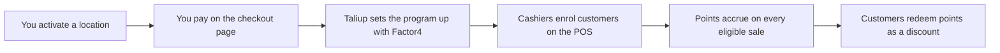

Loyalty lets your customers earn points on what they buy and spend those points as a discount at the register. Points are held by Factor4, the same processor behind Gift Cards. Taliup HQ gives you the program rules, the member list, and the activity history.

You activate Loyalty **one location at a time** as a monthly add-on. Your business has a single loyalty program: the first location you activate creates it, and every location you activate afterwards joins it. Points earned at one location can be spent at any of your other active locations.

Open **Loyalty** in the merchant sidebar.

---

## Prerequisites

<Steps>
  <Step title="Loyalty available on your plan">
    Your ISO admin enables **Loyalty** on the entity plan. If you do not see **Loyalty** in the sidebar, ask them to add it in [Plans & Features](/taliup-hq/onboarding/plans-features).
  </Step>
  <Step title="At least one terminal on the location">
    A location needs a registered terminal before it can be activated. The terminal is registered with Factor4 during setup so it can run loyalty transactions. See [Add devices in HQ](/taliup-hq/devices/pax/add-devices).
  </Step>
  <Step title="A card for the monthly charge">
    Activation is a recurring monthly subscription, billed separately from Gift Cards. You pay on a secure checkout page during activation.
  </Step>
</Steps>

You do not need Gift Cards to run Loyalty, and you do not need Loyalty to run Gift Cards. A location can have either or both.

---

## How it works

A member is one of your **clients**. Cashiers find them by phone number, email, or name, so no physical card is needed. Behind the scenes each member holds a Factor4 account drawn from a pool of numbers Taliup manages for you. You can also link a physical loyalty card if you hand those out.

Points are computed by Taliup from your rules. Factor4 holds the balance, and Taliup keeps a local copy so the member list stays fast, refreshing it every time points are earned, spent, or checked.

---

## Activate a location

<Steps>
  <Step title="Open Loyalty">
    Each of your locations is listed with its current state.
  </Step>
  <Step title="Click Activate">
    Click **Activate** on the location you want to run loyalty at. A secure checkout window opens.
  </Step>
  <Step title="Pay">
    Enter your card details. If you already subscribe to another add-on, the charge is prorated for the rest of the current billing period and added to your existing subscription.
  </Step>
  <Step title="Wait for setup">
    After payment, Taliup sets the location up with Factor4. The location moves to **Active** when setup finishes.
  </Step>
</Steps>

### Location states

| State | Meaning |
| --- | --- |
| **Not activated** | The location has a terminal and can be activated |
| **Checkout pending** | A checkout was started but not paid yet. Use **Resume checkout** to finish it |
| **Setting up** | Payment succeeded, setup with Factor4 is finishing |
| **Active** | Customers can earn and redeem at this location |
| **Suspended** | The subscription ended or a payment failed. Loyalty is off at this location |

The rules, members, and activity sections appear once the program exists.

<Note>
  If setup with Factor4 fails, the charge is reversed automatically and the location stays inactive. Nothing is billed for a setup that did not complete.
</Note>

---

## Program rules

The first activation creates your program with sensible defaults. Change them any time under **Program Rules**. New rules apply to sales made after you save.

### Earning

| Setting | Meaning | Default |
| --- | --- | --- |
| **Points per 1.00 spent** | How many points each unit of currency earns. `1` is one point per dollar; `0.5` is one point per two dollars | 1 |
| **Minimum purchase to earn** | Sales below this amount earn nothing. Leave blank for no minimum | none |
| **Rounding** | How a fractional result is rounded: down, to nearest, or up | Round down |

Points are computed on the **order subtotal after discounts and before tax**. Tips, fees, and taxes never earn points.

### Redeeming

| Setting | Meaning | Default |
| --- | --- | --- |
| **Points per reward** | The size of one reward block | 100 |
| **Reward value** | What one block is worth as a discount | 5.00 |
| **Minimum points to redeem** | Members below this cannot redeem yet. Leave blank for no minimum | none |

Rewards are redeemed in **whole blocks**. With the defaults, a member with 250 points can redeem 100 or 200 points for a 5.00 or 10.00 discount, and keeps the remaining 50. The POS never lets a reward exceed the order total.

The reward is applied as a **pre-tax discount** on the order, so tax is charged on what the customer actually pays. It is not a payment method.

The preview line under the form shows what a 100.00 purchase earns under your current rules.

---

## Card numbers

Every member needs a Factor4 account number. Taliup requests a batch of numbers from Factor4 when the program is created and tops the pool up automatically as it runs low, so cardless enrolment normally needs nothing from you.

If you hand out physical loyalty cards, add their numbers under **Card Numbers**, one per line, as `number` or `number:pin`. Numbers already in the pool or already held by a member are skipped.

A cashier can also link a specific physical card during enrolment by entering its number.

---

## Members

Once the program exists, the page lists every enrolled member.

| Column | Notes |
| --- | --- |
| **Member** | The client's name |
| **Contact** | Phone and email from the client record |
| **Account** | The masked Factor4 account number |
| **Points** | The balance as of the last time it was earned, spent, adjusted, or checked |
| **Lifetime earned** | All points ever awarded to the member |
| **Status** | Active, Suspended, or Closed |

A **Profile conflict** badge means Factor4 refused to attach the client's phone or email to the account, usually because the same phone is already on another Factor4 account. Points are still awarded normally. Fix the phone number on the client record if it is wrong.

---

## Recent activity

The activity table lists the latest enrolments, earns, redemptions, and voids across all your locations, with the member, the location, the points involved, and the purchase or reward amount.

Points are voided automatically when a cashier voids the order they came from. A redemption can be voided the same way, which returns the points to the member.

Points that were earned and then spent cannot be voided, because a balance can never go below zero. When an order is refunded after some of its points were spent, Taliup reclaims whatever balance is left, up to the points that order earned, and records the shortfall on the earn. The activity table shows these as **Adjustment** rows.

### Adjust a member manually

Click **Adjust** on a member to add or remove points with a reason, for example a goodwill credit or a correction after a refund that could not reclaim everything. Removing more points than the member has is refused. Every adjustment is recorded with who made it.

---

## Reports

**Reports** gains a **Loyalty** report type once Loyalty is enabled. Generate it for a date range, optionally for one location, terminal or employee, like any other report. It is built from what Factor4 approved, not from what the register asked for.

| Section | What it shows |
| --- | --- |
| **Summary** | Points earned, points redeemed, reward value granted as discounts (net of voided redemptions), eligible sales, and the net change in members' balances |
| **Membership** | Active members, new members in the period, points outstanding across all members, and the reward liability those points represent at your current rules |
| **By location, employee, day** | The same earn and redeem figures broken down |
| **Top members** | The members with the most activity in the period |
| **Activity** | Every loyalty transaction in the period, including voids, adjustments and declines |

Reward liability is what your outstanding points would cost if every member redeemed today, counted in whole reward blocks. Points outstanding and membership counts are as of now, not as of the report's end date.

---

## Subscription

Loyalty appears under **Settings > Subscriptions** as one item per activated location.

| Action | Effect |
| --- | --- |
| **Cancel** | Stops future billing. Loyalty keeps working until the end of the period you already paid for |
| **Change card** | Updates the card used for the monthly charge |
| **Retry payment** | Collects a failed charge after you update the card |

Cancellation is deferred. At the end of the billing period, the location is detached from your program and can no longer earn or redeem. Members keep their points and can still use them at your other active locations. If no location remains, the program is suspended until you activate one again.

If a monthly charge is declined, you keep access during the grace period while you fix the card. If the grace period runs out, the location is suspended.

---

## Troubleshooting

### Loyalty is not in the sidebar

Ask your ISO admin to enable **Loyalty** on your plan.

### Activate is greyed out

The location needs at least one terminal. Add a terminal to that location, then reload the page.

### The checkout window closed and nothing happened

Reopen **Loyalty**. If the location shows **Checkout pending**, the payment did not complete. Click **Resume checkout** to finish it.

### The location is stuck on Setting up

Setup with Factor4 did not finish. Reload the page. If the rules section shows a setup error, contact support with the message shown.

### A cashier cannot find a customer

Search matches phone digits, email, or name from your client records. Add the customer as a client first, then enrol them.

### Enrolment fails with no card numbers available

The pool is empty and the automatic top-up has not run. Add numbers under **Card Numbers**, or contact support.

### A member shows the wrong balance

The balance shown is from the last time points moved. Ask a cashier to check the balance on the POS to refresh it.

---

## Related

- [Loyalty on the POS](/taliup-pos/loyalty/index)
- [Gift Cards](/taliup-hq/features/gift-cards)
- [Clients](/taliup-hq/features/clients)
