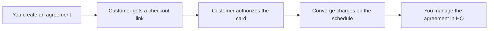

Recurring Payments lets you bill a customer on a schedule. You create an agreement in Taliup HQ, send a hosted checkout link, and the customer authorizes their card. After that, Elavon Converge charges the card on the schedule you set.

Open **Recurring Payments** in the merchant sidebar.

<Frame caption="The Recurring Payments list with status tabs, client search, and agreement rows.">
  
</Frame>

---

## Prerequisites

<Steps>
  <Step title="Recurring Payments enabled">
    The **Recurring Payments** feature must be enabled on the entity plan. Enabling it also turns on **Hosted Payment Solution** and **Clients**. Ask your ISO admin to enable it in [Plans & Features](/taliup-hq/onboarding/plans-features) if you do not see **Recurring Payments** in the sidebar.
  </Step>
  <Step title="Elavon Converge on a location">
    At least one location must have an active **Elavon Converge** online payment gateway. Locations on other processors stay available for everything else. See [Locations](/taliup-hq/onboarding/locations).
  </Step>
  <Step title="Client with an email">
    Each agreement needs a [client](/taliup-hq/features/clients) with a valid email so Taliup can send the checkout invitation.
  </Step>
</Steps>

If Converge is missing, the list shows **Elavon Converge required** and you cannot create agreements.

---

## How it works

- Without a free trial, checkout charges the first cycle today and starts the schedule.
- With a free trial, checkout saves the card only. Charging starts when the trial ends.
- Later cycles are collected by Converge. Taliup HQ syncs status, next date, and charge history.

---

## Agreements list

When you have no agreements yet, the page shows **No recurring agreements yet** and **Create your first agreement**.

Use **+ New agreement** once Converge is available. Use **Settings** for defaults that apply to new agreements.

Tabs:

| Tab | What it includes |
|---|---|
| **All** | Active and pending agreements |
| **Needs attention** | Past due, grace period, paused, failed setup, expired checkout, or a card that is about to expire |
| **Active** | Agreements that are billing |
| **Pending** | Waiting for the customer to complete checkout |
| **Closed** | Completed or cancelled |

Search by client name, then **Apply**. Click a row to open the agreement. **Copy link** copies the checkout link (pending) or the customer manage link (enrolled).

If anything needs a click, the list opens on **Needs attention**.

---

## Create an agreement

<Frame caption="The New recurring agreement form with client, plan items, schedule, and per-cycle total.">
  
</Frame>

<Steps>
  <Step title="Open New agreement">
    From **Recurring Payments**, click **+ New agreement**.
  </Step>
  <Step title="Choose the client and location">
    Search for a client or use the person-plus button to add one. If that email belongs to a deleted client, Taliup asks **Restore previous client?** See [Restore a deleted client](/taliup-hq/features/clients#restore-a-deleted-client).
  </Step>
  <Step title="Add plan items">
    Search products and services, or **Add custom item**. Set quantity and options. Taxes follow the selected location.
  </Step>
  <Step title="Set the schedule">
    Choose frequency. Optionally offer a free trial and an end date.
  </Step>
  <Step title="Create agreement">
    Confirm the **Per-cycle total**, then click **Create agreement**. Taliup emails the checkout link to the client.
  </Step>
</Steps>

### Client

| Setting | Description |
|---|---|
| **Client** | Required. Must have an email. |
| **Location** | The location whose Converge gateway collects the charges. |
| **Allow this customer to cancel** | When on, the customer can cancel from their manage page. You can always cancel from HQ. Defaults from Settings. |

### Plan items

Search the catalog or add a one-off custom item. Catalog items with options open the options picker. Custom items can have their own taxes.

You cannot change catalog items after the agreement is created. Change the amount later from **Update schedule**.

### Schedule

| Setting | Description |
|---|---|
| **Frequency** | **Daily**, **Weekly**, **Biweekly**, **Monthly**, or **Annually**. The Settings default prefills this. |
| **Offer a free trial** | The customer authorizes a card now. Charging starts after the trial. |
| **Trial length** | 1–90 days. The form shows the first-charge date. |
| **End date** | Optional. Leave blank to bill until cancelled. |

The checkout link expiry (default 7 days) is shown on this form. Change it in Settings.

Without a free trial, checkout charges today. The first-charge date is not a separate field unless you turn the trial on.

### Per-cycle total

The sidebar shows subtotal, tax, and total for each billing cycle. This is the amount Converge charges after enrollment (and at checkout when there is no trial).

---

## After you create

The agreement starts as **Pending**.

<Frame caption="The Agreement page with status, card, customer manage link, schedule, items, and charges.">
  
</Frame>

| Action | When it appears |
|---|---|
| **Resend email** | Pending, and the checkout link is still valid |
| **Copy link** | Pending checkout link, or the customer manage link after enrollment |
| **Cancel agreement** | Stops a pending checkout, or stops future charges on an enrolled agreement |

The checkout link expires after the invitation window and can be used once. An expired link cannot be resent. Create a new agreement if the customer still needs to enroll.

After checkout:

- A charge appears under **Charges** (or the card is saved if this is a free trial).
- Status moves to **Active**.
- The **Customer manage link** appears. It does not expire. Customers use it to see history and update their card.

---

## Statuses

| Status | Meaning |
|---|---|
| **Pending** | Waiting for checkout |
| **Active** | Schedule is running |
| **Past due** | A scheduled charge failed. The schedule is still on file |
| **Grace period** | Converge is in its retry window after a failed charge |
| **Suspended** | You paused the agreement. Future charges are stopped |
| **Completed** | The end date was reached |
| **Cancelled** | You or the customer cancelled. Past charges stay captured |
| **Failed** | Enrollment did not finish. The customer may need a new agreement |

---

## Charge now

**Charge now** appears only on **Past due** or **Grace period** agreements that already have a Converge schedule.

It collects one missed payment today. It does not wait for the next scheduled date. It is not available on **Active**.

<Steps>
  <Step title="Open the agreement">
    Open a **Past due** or **Grace period** agreement.
  </Step>
  <Step title="Charge now">
    Click **Charge now**. Confirm the amount and the card last four.
  </Step>
  <Step title="Skip the next scheduled charge">
    The switch **Skip the next scheduled charge on {date}** is on by default when that date is today or tomorrow. Leave it on if you do not want Converge to charge again on that date. Turn it off if you still want the regular cycle to run.
  </Step>
</Steps>

If the card approves, Taliup shows **The missed payment was collected.** Status returns to **Active** when the next Converge date is in the future. It can stay **Past due** if that next date is still today or in the past.

If the card declines, the agreement stays past due. The customer and merchant get decline emails. Try again after the customer updates the card, or on the next scheduled attempt.

The Charge now receipt tells the customer this is a missed payment collected today. Regular cycle receipts name the billing period instead.

---

## When a charge declines

A red banner on the agreement reads **The latest charge was declined.** It can include the processor response.

Taliup emails you and the customer. The customer can open the manage link and click **Update payment method**. Updating the card does not collect the missed payment by itself.

<Frame caption="A past-due agreement after the customer updated the card. Charge now is available.">
  
</Frame>

After the customer updates the card, a blue banner shows **The customer updated the card on file** and the update date. If the agreement is still past due, it reminds you to use **Charge now**.

The banner stays until either:

- Status is **Active** again, or
- A successful charge is collected at or after the card update (Charge now or the next scheduled sale)

---

## Pause, resume, and cancel

| Action | What it does |
|---|---|
| **Pause** | Available on Active, Past due, and Grace period. Converge stops future charges until you resume. |
| **Resume** | Available on Suspended. Scheduled charges start again. |
| **Cancel agreement** | Stops future charges. Past charges stay captured. A pending cancel only disables the checkout link. |

You cannot change frequency or the next payment date while the agreement is paused. Resume first.

Customers can cancel from the manage page only when **Allow this customer to cancel** is on for that agreement.

---

## Update schedule

On an enrolled agreement, **Update schedule** can change:

- **Amount**
- **Frequency** (not while paused)
- **Next payment** (not while paused)
- **End date**

Catalog items stay the same. Click **Save schedule**.

---

## Settings

From the Recurring Payments list, click **Settings**.

<Frame caption="Recurring Payment Settings for customer access, invitations, defaults, and alerts.">
  
</Frame>

| Setting | Description |
|---|---|
| **Allow customers to cancel** | Default for new agreements. You can still override it on each create form. Off by default. |
| **Checkout link expiry (days)** | How long the first-payment link stays valid (1–90, default 7). Expired links cannot be resent. |
| **Default billing frequency** | Prefills **New agreement**. |
| **Card expiry warning (days)** | How far ahead **Needs attention** flags an expiring card (default 60). |

Click **Save Recurring Payment Settings**.

---

## What customers see

Customers do not log in to Taliup HQ.

- **Checkout link** — one-time page to pay today or authorize a card for a free trial. They must check **I authorize {merchant} to charge my card…**
- **Customer manage link** — does not expire. Customers can view the schedule, charge history, and **Update payment method**. **Cancel payment** appears only if you allowed it.

Share either link from the agreement page. The manage link is also in customer emails after enrollment.

---

## Emails

| Email | When it sends |
|---|---|
| Checkout invitation | When you create an agreement, and when you click **Resend email** |
| Receipt | After a successful cycle or Charge now |
| Payment declined | After the latest charge fails — sent to you and the customer |
| Schedule updated | When you change amount, frequency, or dates |

Ask the customer to check junk if an invitation is missing. Confirm the client email on the agreement before you resend.

---

## Troubleshooting

### Recurring Payments is not in the sidebar

Ask your ISO to enable **Recurring Payments** on the entity plan. It requires **Hosted Payment Solution** and **Clients**.

### You cannot create an agreement

Add an active Elavon Converge gateway to at least one location.

### Customer did not get the checkout email

1. Confirm the client email on the agreement.
2. Ask them to check junk.
3. Use **Resend email** if the link is still valid, or **Copy link** and send it yourself.
4. If the link expired, create a new agreement.

### Checkout expired or is no longer available

The first-payment link is single-use and expires after the invitation window. Create a new agreement for a fresh link.

### Latest charge was declined

Send the customer the manage link so they can update the card. Then use **Charge now** if you need the missed payment today. The next scheduled attempt still runs unless you skip it from Charge now.

### Charge now is missing

The agreement must be **Past due** or **Grace period**, and checkout must have already enrolled the Converge schedule. Pending and Active agreements do not show Charge now.

### Card was updated but the agreement is still past due

Updating the card does not collect the missed payment. Use **Charge now**, or wait for the next scheduled charge.

### Customer wants to stop billing

Use **Cancel agreement**, or ask them to cancel from the manage page if you allowed it. Pause if you only need to stop charges temporarily.

---

## Related

- [Clients](/taliup-hq/features/clients)
- [Hosted Payments](/taliup-hq/features/hosted-payments)
- [Locations](/taliup-hq/onboarding/locations)
- [Plans & Features](/taliup-hq/onboarding/plans-features)
