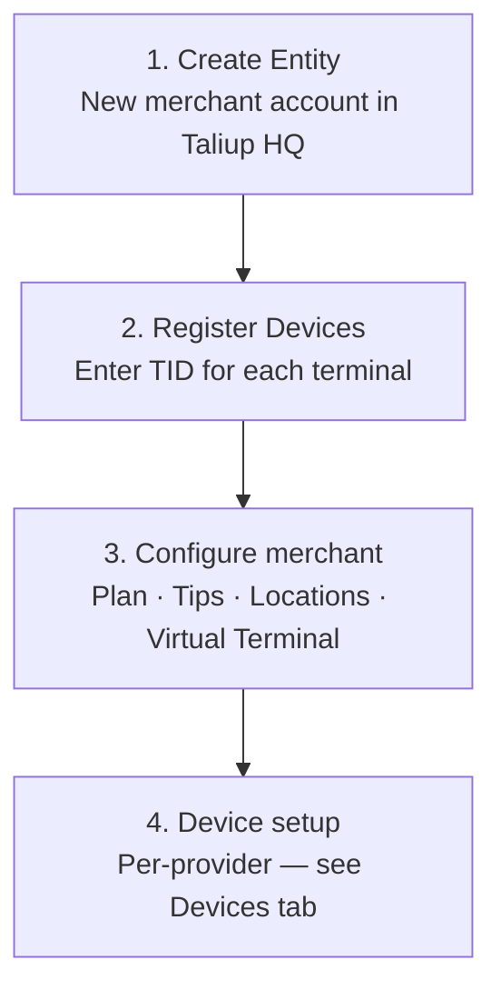

[Taliup HQ](https://taliuphq.com) is the central dashboard for ISOs and implementers. Use it to create merchant accounts (Entities), register payment terminals, configure payment settings, and manage every aspect of a merchant's Taliup environment.

<Frame caption="Taliup HQ dashboard — the central hub for merchant and device management.">
  
</Frame>

## Onboarding a merchant

Follow these steps in order when setting up a new merchant:

<Steps>
  <Step title="Create a merchant (Entity)">
    Create the merchant account in Taliup HQ. This also creates the first Employee user automatically.

    [Create a merchant →](/taliup-hq/onboarding/create-entity)
  </Step>
  <Step title="Register devices">
    Before staff can log in on a terminal, each device must be registered in Taliup HQ with the TID from your device provider (for example, PaxStore for PAX terminals).

    [PAX device setup →](/taliup-hq/devices/pax/index)
  </Step>
  <Step title="Configure merchant settings">
    Optionally configure Plans & Features, Tips, Locations, Virtual Terminal, Dual Pricing, and Surcharge to match the merchant's requirements.

    [Configuration overview →](/taliup-hq/onboarding/plans-features)
  </Step>
</Steps>

## What you can configure

<CardGroup cols={2}>
  <Card title="Plans & Features" icon="star" href="/taliup-hq/onboarding/plans-features">
    Set the merchant's billing tier and control which features are available.
  </Card>
  <Card title="Tips" icon="hand-holding-dollar" href="/taliup-hq/onboarding/tips">
    Enable tip prompts on the customer-facing payment screen with percentage or fixed-amount presets.
  </Card>
  <Card title="Locations" icon="location-dot" href="/taliup-hq/onboarding/locations">
    Manage physical merchant sites, MIDs, and online payment gateway credentials.
  </Card>
  <Card title="Virtual Terminal" icon="monitor" href="/taliup-hq/onboarding/virtual-terminal">
    Process card-not-present payments directly from the Taliup HQ dashboard.
  </Card>
  <Card title="Dual Pricing" icon="tags" href="/taliup-hq/onboarding/dual-pricing">
    Show a cash price and a card price at checkout, with the difference covering the processing fee.
  </Card>
  <Card title="Surcharge" icon="percent" href="/taliup-hq/onboarding/surcharge">
    Add a flat or percentage fee on top of the transaction total for card payments.
  </Card>
</CardGroup>
