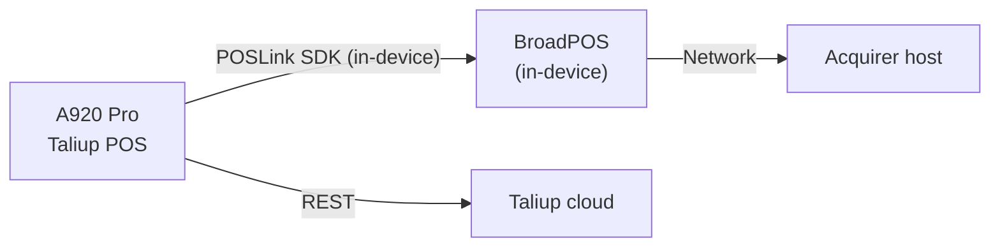

The PAX A920 Pro is a standalone all-in-one terminal. **Taliup POS** and **BroadPOS** run on the same device — there is no companion display, no pairing step, and no connection configuration needed. First setup is simply logging in and running a test sale.

## How the system works

- **Taliup POS** on the A920 Pro is the all-in-one cashier POS and customer-facing payment terminal.
- **BroadPOS** (installed alongside Taliup POS) processes card payments directly on the same device using the POSLink SDK — no companion display, no external connection required.
- The A920 Pro communicates with Taliup HQ for login, transaction posting, and subscription verification.

## Before you start

Confirm the following are complete before opening Taliup POS on the A920 Pro:

- [PaxStore setup](/taliup-hq/devices/pax/paxstore) — BroadPOS Manager, acquirer BroadPOS app, and Taliup POS pushed to the A920 Pro.
- [Taliup HQ device registration](/taliup-hq/devices/pax/add-devices) — Entity created and the A920 Pro registered as a Device with its TID.
- The A920 Pro powered on and connected to the internet.
- A **demo passcode** from your ISO if the merchant is on a Subscription plan (the default is often `000000`).

## Step 1 — First login

<Steps>
  <Step title="Open Taliup POS">
    Open **Taliup POS** on the A920 Pro.

    <Frame caption="Taliup POS login screen on the PAX A920 Pro.">
      
    </Frame>

    If no users appear on the login screen, the A920 Pro TID is not yet registered in Taliup HQ — complete [device registration](/taliup-hq/devices/pax/add-devices) first.
  </Step>
  <Step title="Enable Demo Mode (Subscription plans only)">
    If the merchant's Taliup plan is **Subscription**, open the overflow menu (top-right **⋮**) and choose **Demo Mode**. Enter the six-digit demo passcode from your ISO. The default is often `000000`.

    <Frame caption="The overflow menu on the A920 Pro showing the Demo Mode option.">
      
    </Frame>
  </Step>
  <Step title="Log in">
    Enter the merchant user's six-digit passcode. Use the Employee passcode created when the Entity was set up in Taliup HQ (for demo setups this is often `111111`).
  </Step>
</Steps>

## Step 2 — Test with a small sale

<Steps>
  <Step title="Open Register">
    In Taliup POS, go to **Home** → **Register**.
  </Step>
  <Step title="Run a test sale">
    Enter a small amount (for example `$0.01`) and tap **Charge**. Complete any tip, surcharge, or dual-pricing prompts, then follow the on-screen card instructions to tap or insert a card.
  </Step>
  <Step title="Confirm the transaction">
    Confirm the sale appears under **Transactions** in Taliup POS. Confirm the same transaction appears in Taliup HQ.
  </Step>
</Steps>

A successful test confirms BroadPOS configuration and cloud connectivity.

## Rules for reliable operation

| Rule | What to do |
|---|---|
| Device in Taliup HQ before login | The A920 Pro must be registered as a Device in Taliup HQ before the first POS login. |
| Internet | The A920 Pro needs internet for Taliup cloud services and for BroadPOS to reach the acquirer host. |
| Location enabled in HQ | If an ISO Administrator disables the merchant's Location in Taliup HQ, the device is locked out of Taliup POS. |
| Payment apps installed | BroadPOS Manager and the acquirer BroadPOS app must be installed and configured. See [PaxStore setup](/taliup-hq/devices/pax/paxstore) if payments fail. |

## Troubleshooting

| Problem | What to try |
|---|---|
| No users on login screen on first setup | Confirm the A920 Pro TID exists in PaxStore and a matching Device record exists in Taliup HQ before opening Taliup POS. Confirm the Entity has at least one assigned user (an Employee is created automatically when the Entity is created in Taliup HQ). |
| Demo Mode passcode rejected | Confirm the passcode with your ISO, confirm the device has internet, and confirm the TID is registered in Taliup HQ. |
| Device keeps logging out with 503 errors | The marketplace subscription may have expired. Renew in PaxStore or use Demo Mode. |
| Merchant locked out of Taliup POS | An ISO Administrator may have disabled the merchant's Location in Taliup HQ. Re-enable it under Settings → Locations. |
| No card prompt after tapping Charge | BroadPOS is missing or misconfigured. Re-push BroadPOS Manager, then the acquirer BroadPOS app with VAR parameters, then Taliup POS — in that order. See [PaxStore setup](/taliup-hq/devices/pax/paxstore). |
| Card prompt appears but payment is declined or fails | Verify the acquirer BroadPOS parameters (TID, MID, host URL) match the VAR sheet. Re-push the acquirer BroadPOS app with corrected parameters if needed. |

For PaxStore push issues, see [PaxStore setup](/taliup-hq/devices/pax/paxstore). For HQ configuration issues, see [Taliup HQ merchant setup](/taliup-hq/index).
