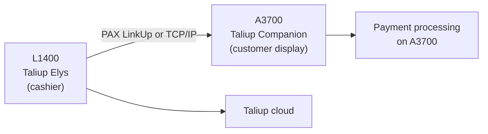

The PAX Elys uses two physical devices: an **L1400** cashier terminal running **Taliup Elys**, and an **A3700** customer display running **Taliup Companion**. First setup involves logging in on the L1400, configuring the connection mode, and verifying that the two devices communicate before running a test sale.

## How the system works

- **Taliup Elys** on the L1400 is the cashier POS — where staff ring up sales.
- **Taliup Companion** on the A3700 is the customer-facing display — where the customer sees the order and completes card payment.
- The two apps connect using the best available transport. **USB Preferred** mode (default) tries PAX LinkUp first, then Raw TCP/IP automatically. **TCP Only** mode requires a Wi-Fi or LAN connection and an explicit IP address.
- The apps monitor the connection continuously. If the link drops, a yellow banner appears on Register or Transactions — you do not need to start a sale to notice.

<Note>
  On PAX Elys hardware, the USB cable and pogo pin connection carries **charging only**. AOA USB and USB Network TCP are not supported due to the A3700's hardwired USB host role. The effective transport chain is **PAX LinkUp (Wi-Fi) → Raw TCP/IP**.
</Note>

## Before you start

Confirm the following are complete before opening Taliup Elys on the L1400:

- [PaxStore setup](/taliup-hq/devices/pax/paxstore) — apps pushed to both the L1400 (Taliup Elys) and A3700 (BroadPOS Manager, acquirer BroadPOS app, Taliup Companion).
- [Taliup HQ device registration](/taliup-hq/devices/pax/add-devices) — Entity created, both L1400 and A3700 registered as Devices with their TIDs.
- Both devices powered on and connected to the internet on the **same Wi-Fi network** (required for PAX LinkUp; also required for TCP transport).
- A **demo passcode** from your ISO if the merchant is on a Subscription plan (the default is often `000000`).

## Step 1 — Foreground both apps

Before configuring the connection, bring both apps to the foreground:

- **A3700:** Open **Taliup Companion** and wait until the idle screen shows the business name.
- **L1400:** Open **Taliup Elys**.

## Step 2 — First login on the L1400

<Steps>
  <Step title="Select Elys">
    On the card reader selection screen, select **Elys** and tap **Next**.
  </Step>
  <Step title="Enable Demo Mode (Subscription plans only)">
    If the merchant's Taliup plan is **Subscription**, open the overflow menu (top-right **⋮**), choose **Demo Mode**, and enter the six-digit demo passcode from your ISO. The default is often `000000`.
  </Step>
  <Step title="Log in">
    Enter the merchant user's six-digit passcode. Use the Employee passcode created when the Entity was set up in Taliup HQ (for demo setups this is often `111111`).

    If no users appear on the login screen, the L1400 TID is not yet registered in Taliup HQ — complete [device registration](/taliup-hq/devices/pax/add-devices) first.
  </Step>
</Steps>

## Step 3 — Configure the connection to the A3700

<Steps>
  <Step title="Open Device Settings">
    On the L1400, go to **Settings** → **Device Settings**.
  </Step>
  <Step title="Select a connection mode">
    Under **Connection Mode**, choose the mode for your deployment:

    | Mode | When to use |
    |---|---|
    | **USB Preferred** (default) | Tries PAX LinkUp first, then falls back to Raw TCP/IP. Both devices must be on the same Wi-Fi network for PAX LinkUp to work. No IP address required if you are using PAX LinkUp only. |
    | **TCP Only** | Wi-Fi/LAN only. Requires both devices on the same network and an IP address entered below. |

    <Frame caption="Device Settings on the L1400, showing the Connection Mode selector and IPv4 Address field.">
      
    </Frame>
  </Step>
  <Step title="Find the A3700 IP address (TCP transport)">
    If you are using **TCP Only**, or want Raw TCP/IP available as a fallback in **USB Preferred** mode, find the A3700's IP address:

    1. With **Taliup Companion** showing the idle screen on the A3700, **double-tap** or **long-press** anywhere on the screen.
    2. The IP address and port appear briefly in the top-left corner for about 5 seconds. Double-tap again to show them once more.
    3. Note the IP address. The port is **12345** unless your deployment uses a different value.

    <Frame caption="Taliup Companion on the A3700 showing the IP address and port in the top-left corner after a double-tap.">
      
    </Frame>

    If you are using **USB Preferred** mode with PAX LinkUp only, skip this step.
  </Step>
  <Step title="Enter IP address and port (TCP transport)">
    Back in **Device Settings** on the L1400, enter the A3700's IP address in **IPv4 Address** and `12345` in **Port**. Leave these blank if you are using PAX LinkUp only.
  </Step>
  <Step title="Save and diagnose">
    Tap **Save**.

    Tap **Diagnose Companion Connection**. If the result is **Healthy**, the connection is active and Companion is responding. If it reports an error, see [Troubleshooting](#troubleshooting) below.
  </Step>
</Steps>

## Step 4 — Test with a small sale

<Steps>
  <Step title="Open Register">
    On the L1400, go to **Home** → **Register**.
  </Step>
  <Step title="Check for connection issues">
    Confirm there is no yellow **Companion display disconnected** banner at the top of Register. On the A3700, Companion should leave the idle screen and show an empty order display.

    If the yellow banner appears, tap **Connection Diagnosis** in the banner and follow the on-screen report to fix the issue before proceeding.
  </Step>
  <Step title="Run a test sale">
    Enter a small amount (for example `$0.01`) and tap **Charge**. On the A3700, complete any tip, surcharge, or dual-pricing prompts, then follow the on-screen card instructions.
  </Step>
  <Step title="Confirm the transaction">
    On the L1400, confirm the sale appears under **Transactions**. Confirm the same transaction appears in Taliup HQ.
  </Step>
</Steps>

A successful test confirms pairing, payment app configuration, and cloud connectivity.

## Understanding the connection warning

When Taliup Elys and Taliup Companion lose their link, the L1400 shows a **yellow banner** at the top of Register and Transactions:

*"Companion display disconnected — please wait for reconnection or click Connection Diagnosis."*

- **Connection Diagnosis** (in the banner) and **Diagnose Companion Connection** (in Device Settings) run the same step-by-step connection test.
- When Companion comes back online, the apps typically reconnect within about **10 seconds** and the banner clears automatically.
- During an active card payment (tip, surcharge, or processing), the banner may be hidden even if the connection dropped. If the payment fails, check the connection after the payment finishes.

<Frame caption="The yellow connection banner on the L1400 Register screen, with the Connection Diagnosis button.">
  
</Frame>

## Rules for reliable operation

| Rule | What to do |
|---|---|
| Devices in Taliup HQ before login | Both L1400 and A3700 must be registered as Devices in Taliup HQ before the first POS login. |
| Keep Companion open | Do not switch away from or close Taliup Companion on the A3700 during a payment. |
| Same Wi-Fi network | Keep both devices on the same Wi-Fi network. PAX LinkUp uses Wi-Fi even when the devices are physically attached. Do not use guest Wi-Fi or a separate network segment. |
| Same network for TCP fallback | If TCP/IP is your primary or fallback transport, both devices must stay on the same Wi-Fi or local network. |
| USB cable — charging only | On PAX Elys hardware, the USB cable and pogo pin carry charging only. PAX LinkUp (Wi-Fi) is the data transport. |
| Stable A3700 IP (TCP only) | Ask IT for a fixed IP on the A3700. If the IP changes, update the IPv4 Address in Device Settings on the L1400. |
| Port 12345 (TCP only) | The standard Companion TCP port. Update Device Settings if your deployment uses a different port. |
| Payment apps on A3700 | BroadPOS Manager and the acquirer BroadPOS app must be installed and configured on the A3700. See [PaxStore setup](/taliup-hq/devices/pax/paxstore) if payments fail. |
| Sleep / screen off | Putting a device to sleep can drop the connection. Wake both devices and wait for reconnect, or run Connection Diagnosis. |
| Yellow banner during payment | The banner may be hidden while a card payment is in progress. If a payment fails, check the connection after the payment flow finishes. |
| Internet | Both devices need internet — the L1400 for Taliup cloud services, the A3700 for card processing. |
| Location enabled in HQ | If an ISO Administrator disables the merchant's Location in Taliup HQ, associated devices are locked out of Taliup POS. |

## Troubleshooting

| Problem | What to try |
|---|---|
| Yellow **Companion display disconnected** banner | Open Taliup Companion on the A3700 and wake the device. Confirm both devices are on the same Wi-Fi network. For TCP: confirm IP and port in Device Settings. Wait ~10 seconds for reconnect, or tap Connection Diagnosis in the banner. |
| Companion connection lost or payment fails before card prompt | Restore the connection first (see above), then retry the sale. |
| Connection Diagnosis shows no local network | Connect the L1400 to Wi-Fi or Ethernet on the same network as the A3700. Required for both PAX LinkUp and TCP transports. |
| Connection Diagnosis shows host unreachable or port closed | Wrong IP address, different network, or Companion not running. Fix the IP, put both devices on the same network, and open Companion on the idle screen. Applies to TCP transport only. |
| Connection Diagnosis shows Companion not responding | Reinstall or update Taliup Companion from PaxStore. Confirm port 12345 and that Companion is the app running on the A3700. |
| Banner cleared but payment still fails | Run Diagnose Companion Connection in Device Settings again. Restart Taliup Companion on the A3700. |
| L1400 cannot reach Companion at all (TCP Only mode) | Move both devices to the same Wi-Fi network. Avoid guest networks or separate VLANs. |
| Connection Diagnosis shows `USB_NETWORK_TCP_NO_NETWORK` or `AOA_USB_PROTOCOL_FAILED` | Expected on PAX Elys hardware — AOA USB and USB Network TCP are not supported. These transports are automatically skipped. The connection uses PAX LinkUp or Raw TCP/IP. No action needed. |
| USB Preferred connected but banner still showing | PAX LinkUp not connecting, or Companion not foregrounded. Confirm Companion is on the A3700 idle screen and both devices are on the same Wi-Fi. If PAX LinkUp is unavailable, enter an IP address so Raw TCP/IP can connect. |
| PAX LinkUp not working (falling back to TCP) | Petunia/Honeybee not installed on both devices, or devices not bound in the same Honeybee group. PAX LinkUp requires Petunia and Honeybee installed on both L1400 and A3700 and bound together. Not all devices ship with these pre-installed — check with your PAX reseller. If unavailable, USB Preferred mode falls back to Raw TCP/IP. |
| IP and port do not appear when tapping the A3700 | Wait until Companion returns to the idle screen (not mid-payment or showing an order). Double-tap or long-press once. |
| No users on login screen on first setup | Confirm the L1400 TID exists in PaxStore and a matching Device record exists in Taliup HQ before opening Taliup POS. |
| Demo Mode passcode rejected | Confirm the passcode with your ISO, confirm the L1400 has internet, and confirm the TID is registered in Taliup HQ. |
| L1400 keeps logging out with 503 errors | The marketplace subscription may have expired. Renew in PaxStore or use Demo Mode. |
| Merchant locked out of Taliup POS | An ISO Administrator may have disabled the merchant's Location in Taliup HQ. Re-enable it under Settings → Locations. |

For BroadPOS or PaxStore push issues, see [PaxStore setup](/taliup-hq/devices/pax/paxstore). For HQ configuration issues, see [Taliup HQ merchant setup](/taliup-hq/index).
